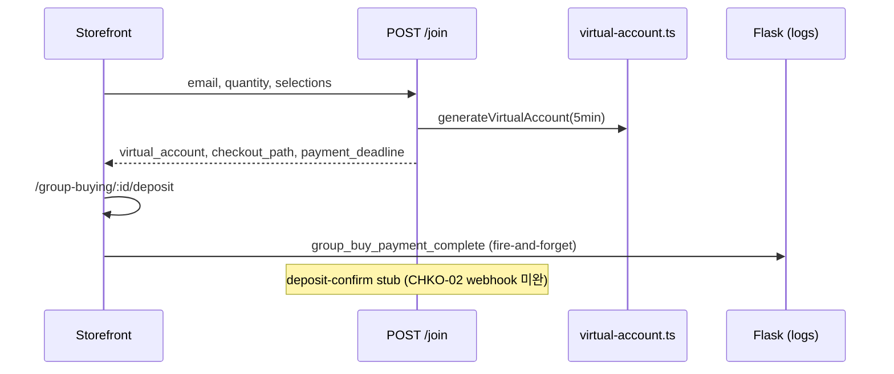
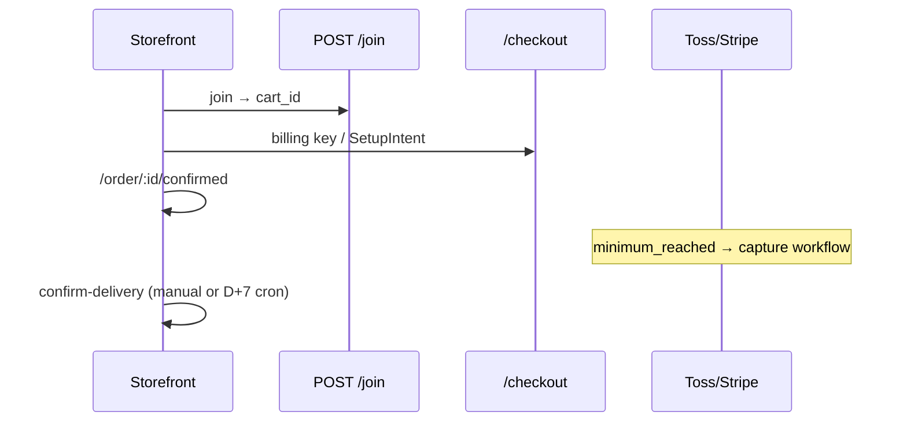

# Group Buying Site — 프로젝트 현황 및 기술 문서

> **작성 기준일:** 2026-07-18 (최초 2026-07-15)  
> **저장소:** [github.com/yjj0066/group_buying](https://github.com/yjj0066/group_buying)  
> **경로:** `group-buying-site/` (pnpm monorepo)  
> **스택:** Medusa v2.17.2 (`@dtc/backend`) + Next.js 15.5.18 (`@dtc/storefront`)  
> **기준 스펙:** Excel v3 (`_spec_extract_v3.txt`) + v2 (`_spec_extract_v2.txt`)  
> **관련 문서:** [README.md](./README.md) · [CODE_ANALYSIS.md](./CODE_ANALYSIS.md)

---

## 1. 프로젝트 개요

K-POP 굿즈(앨범, 응원봉, 포토카드 등)를 대상으로 **총대(리더) 중심의 공동구매(Group Deal)** 를 운영하는 이커머스 플랫폼이다.

**결제 모델 (이중 경로):**

| 경로 | 설명 |
|------|------|
| **v3 가상계좌** | join → VA 발급 → `/deposit` 입금 안내 (5분 홀드, stub 자동 확인) |
| **PG 에스크로** | join → cart → checkout → Toss 빌링키 / Stripe SetupIntent → minimum_reached 일괄 캡처 |

**하이브리드 AI (Flask):** Medusa는 결제·주문·재고만 담당하고, Flask는 **검색·추천·행동 로그**만 담당한다. Flask 장애 시 검색/추천 UI는 숨김 처리되며, 장바구니·결제 UX는 영향받지 않는다. **로컬 dev에서는 Flask 기본 OFF** (`SEARCH_API_ENABLED=false`).

### 1.1 2026-07-15 변경 요약

| 구분 | 내용 |
|------|------|
| **P2** | HOME-03 (최애 랜딩), DASH-05 (AI 단가 추천), MTRS-01 (신뢰·후기) |
| **P0/P1** | OPEN 상태 통일, CHKO VA, HOME-01 redirect, MYJN 후기/분쟁/D+7, 정산 API |
| **성능** | Flask dev OFF, 800ms timeout, Turbopack, landing fetch dedup, middleware 2s |
| **운영** | Admin SDK 401 수정, API route import path 수정 (backend startup crash 해결) |

### 1.2 2026-07-18 변경 요약

| 구분 | 내용 |
|------|------|
| **GB App UI** | `(gb-app)` 라우트 — 참여자 7단계, 총대 10단계, 마이 9화면 (와이어프레임 기반) |
| **온보딩** | splash → login → signup → bank-account → `/home` |
| **모드 전환** | participant/leader cookie + 하단 탭 + optimistic UI |
| **버그 수정** | `[id]`/`[participantId]` slug 충돌, `leader-settlement-view` import, dev server 500 |
| **INP 최적화** | 검색 debounce 200ms, React.memo 카드, 카탈로그 결과 분리 |
| **백엔드 갭** | `POST .../apply` mock, seat hold API 미구현, Upstage OCR 연동 예정 |

---

## 2. 현재까지 구현된 핵심 기능

### 2.1 백엔드 — 공동구매 도메인 모듈

| 영역 | 구현 내용 |
|------|-----------|
| **커스텀 모듈** | `src/modules/group-buying/` — `GroupBuyingModuleService` |
| **데이터 모델** | `GroupDeal`, `GroupDealOption`, `GroupDealParticipant`, `GroupDealParticipantSelection`, `GroupDealWaitlistEntry` |
| **상태 머신** | `GroupDealStatus` (`DRAFT`, `OPEN`, `MINIMUM_REACHED`, `CLOSED`, `SETTLED` 등) |
| **상태 정합성** | `ACTIVE` 참조 제거 → **`OPEN`으로 통일** (cron, store filter, storefront types) |
| **참여 규칙** | `assertDealJoinable`, `evaluateDealStatus`, `countUniqueCommittedParticipants` |
| **옵션/1차금** | `resolveParticipantQuantity`, `computeFirstPaymentAmount`, `assertSelectionsWithinLimits` |
| **리더 통계** | `group-deal-leader-stats.ts` — `leader_role_number`, `is_first_time_leader` |
| **총대 신뢰 집계** | `leader-trust-profile.ts` — MTRS trust score, badge, reviews (metadata 기반) |
| **AI 단가 추천** | `group-deal-price-recommendations.ts` — fill rate, vacancy risk, recommended price |
| **가상계좌** | `utils/virtual-account.ts` — CHKO stub VA 생성 |
| **문서 AI stub** | `utils/document-extract-stub.ts` — 영수증 구조화 필드 추출 |
| **직렬화** | `group-deal-store.ts` — `opening` 타임라인, `declared_album_quantity`, receipt fields |
| **계정/정산** | `group-deal-account.ts` — participation stage, `buildSettlementRecords()` |
| **D+7 자동 수령** | `service.autoConfirmOverdueDeliveries()` — tracking +7일, open dispute skip |

### 2.2 백엔드 — 결제·에스크로·빌링

| 영역 | 구현 내용 |
|------|-----------|
| **토스페이먼츠 PG** | `src/modules/toss-payments/` — 빌링키 등록·캡처·환불 |
| **Stripe 공동구매 PG** | `src/modules/stripe-group-deal/` — SetupIntent 예약 결제 |
| **한국 PG (일반 결제)** | `src/modules/korean-pg-payment/` |
| **에스크로 해제** | `GroupDealEscrowService.releaseParticipantEscrow()` |
| **Join + VA** | `POST .../join` — VA, `checkout_path` → deposit, `payment_deadline` **5분** |
| **입금 확인 stub** | `POST .../deposit-confirm` — CHKO-02 placeholder |
| **총대 보증금** | `POST /store/me/group-deals/:id/deposit` — leader deposit workflow |

### 2.3 백엔드 — 워크플로우

| 워크플로우 | 역할 |
|------------|------|
| `prepareGroupDealCheckoutWorkflow` | 참여 슬롯 예약 → 카트/VA 생성 → 1차금 산출 |
| `captureGroupDealPaymentsWorkflow` | minimum_reached 후 RESERVED 일괄 캡처 |
| `processOverdueParticipantsWorkflow` | 입금 기한 초과 슬롯 해제 |
| `confirmParticipantDeliveryWorkflow` | 수령 확인 → 정산 경로 |
| `recordLeaderDepositWorkflow` | 총대 보증금 입금 기록 |
| `vacateParticipantSlot` + waitlist | 공석 → `matchWaitlistEntry` |
| `joinDemandSurveyWorkflow` | 수요조사 참여 |

### 2.4 백엔드 — Store API (`/store`)

| Method | 경로 | 설명 |
|--------|------|------|
| GET | `/store/group-deals` | 목록 (`?navigation=true` — deposit 필터 완화) |
| GET | `/store/group-deals/:id` | 상세 + options + leader stats |
| GET | `/store/group-deals/by-product/:productId` | 상품별 연결 공구 |
| POST | `/store/group-deals/:id/join` | 참여 → VA + deposit path |
| POST | `/store/group-deals/:id/deposit-confirm` | VA 입금 확인 stub |
| POST | `/store/group-deals/:id/waitlist` | 대기열 |
| GET | `/store/products/search-index` | Flask 색인 피드 |

**인증 `/store/me`:**

| Method | 경로 | 설명 | 스펙 |
|--------|------|------|------|
| GET/POST | `/store/me/bank-account` | 환불 계좌 | ACCT-01 |
| GET/PUT | `/store/me/preferences` | 알림·최애·`preferred_role` | MALM, SGN |
| GET | `/store/me/trust-profile` | 총대 신뢰 프로필 | MTRS-01 |
| POST | `/store/me/trust-profile/reviews/:reviewId/report` | 후기 신고 | MTRS-01 |
| GET | `/store/me/group-deals/:id/price-recommendations` | AI 단가 추천 | DASH-05 |
| POST | `/store/me/group-deals/:id/apply-price-recommendations` | 추천가 일괄 적용 | DASH-05 |
| POST | `/store/me/group-deals/:id/urgent-fill` | 긴급 모집 | QFIL |
| POST | `/store/me/group-deals/:id/deposit` | 총대 보증금 | CRTE |
| GET | `/store/me/group-deals/hosted` | 총대 공구 목록 | DASH |
| GET | `/store/me/group-deals/participations` | 참여 목록 | MYJN |
| POST | `/store/me/group-deals/participations/:id/review` | 후기 | MYJN-05 |
| POST | `/store/me/group-deals/participations/:id/dispute` | 분쟁 | MYJN-06 |
| POST | `/store/me/group-deals/participations/:id/confirm-delivery` | 수령 확인 | MYJN |
| GET | `/store/me/group-deals/settlements` | 정산 내역 | MSTL |
| GET/POST/DELETE | `/store/me/payment-methods` | 결제수단 CRUD | MPAY |

인증 미들웨어: `api/store/me/middlewares.ts`

### 2.5 백엔드 — Admin API 및 대시보드 UI

| 영역 | 경로 |
|------|------|
| **Admin REST** | CRUD, capture, settle, cancel, receipt, tracking 등 |
| **영수증** | `POST/GET admin/group-deals/:id/receipt` — AI stub 추출 + 자동 검증 |
| **Admin SDK** | `admin/lib/sdk.ts` + `admin-fetch.ts` — Medusa JS SDK JWT (**401 수정**) |
| **Admin UI** | `src/admin/routes/group-deals/` — CRUD, LeaderManagementPanel |

### 2.6 백엔드 — 이벤트·스케줄러

| 구성요소 | 동작 |
|----------|------|
| `group-deal-minimum-reached-capture` | minimum_reached → 일괄 캡처 |
| `order-placed-group-deal` | 주문 완료 → 참여 상태 갱신 |
| `group-deal-notifications` | metadata `notification_log` 기록 |
| `group-deal-maintenance` | **매시간:** 미결제 만료, `ends_at` 경과 `CLOSED`, **D+7 autoConfirmOverdueDeliveries** |

### 2.7 백엔드 — 단위 테스트

`src/utils/__tests__/` — 9개 spec (rules, options, escrow, store, admin-rules, deposit-guards, toss, webhook 등)

> **미커버:** `leader-trust-profile.ts`, `group-deal-price-recommendations.ts` — 전용 spec 없음

---

### 2.8 Flask 하이브리드 AI (Partner ↔ Practice)

| 영역 | 파일/경로 | 설명 |
|------|-----------|------|
| **설정** | `lib/config/flask-search.ts` | dev OFF 기본, `getFlaskRequestTimeoutMs()` (800/2500ms) |
| **검색** | `lib/data/flask-search.ts` | `GET /api/v1/products/search` |
| **추천** | `lib/data/ai-engine.ts` | landing (`deadline_popularity`, `favorite_idol_group`) / similar |
| **하이드레이션** | `lib/data/hydrate-recommended-products.ts` | Flask ID → Medusa 상품 |
| **행동 로그** | `lib/data/flask-behavior-log.ts`, `lib/util/flask-behavior-log.ts` | fire-and-forget |
| **BFF** | `app/api/ai/search`, `recommendations`, `events` | Next.js Route Handlers |
| **색인 피드** | `GET /store/products/search-index` | Medusa → Flask 동기화 |

**Flask API 계약:** [docs/api-contract-for-merge.md](./docs/api-contract-for-merge.md)

---

### 2.9 스토어프론트 — Flask 검색·추천·로그

| 구성요소 | 파일 | 설명 |
|----------|------|------|
| **검색바** | `modules/layout/components/product-search/` | `/{country}/store?q=` |
| **검색 결과** | `modules/store/templates/paginated-products.tsx` | Flask 전용 (`isFlaskSearchEnabled` gate) |
| **AI 추천 슬라이더** | `modules/products/components/ai-recommendation-slider/` | landing / similar, favorite_idol_group |
| **랜딩 배치** | `landing-page-client.tsx` | Hero 아래 `context=landing` |
| **상세 배치** | `group-deal-detail/index.tsx` | 하단 `context=similar` |
| **행동 로그** | `flask-behavior-logger`, order-completed, product-actions | 3 event types |

---

### 2.10 스토어프론트 — 랜딩 (`(landing)`)

| 구성요소 | 파일 | 스펙 |
|----------|------|------|
| **역할 redirect** | `(landing)/page.tsx` | HOME-01 — leader → hosted, participant → group-buying |
| **템플릿** | `landing-page/index.tsx` | `initialCustomer` → preferences dedup |
| **데이터** | `lib/util/landing-deals.ts` | API + MOCK fallback + `prioritizeByIdol()` |
| **AI 추천** | `AiRecommendationSlider` | HOME-03 — `favoriteIdolGroup` prop |
| **섹션** | Hero, Popular, Ending Soon, Trending, Categories 등 | HOME-03 |

---

### 2.11 스토어프론트 — 공동구매 (SRCH / DETL / CHKO)

| 구성요소 | v3 스펙 | 비고 |
|----------|---------|------|
| `group-deals-catalog`, `group-deal-filters` | SRCH, QFIL | client-side filter |
| `group-deal-detail/` | DETL | 타임라인, trust, receipt, join |
| `group-deal-timeline/` | DETL-04 | 7단계 (`opening` 포함) |
| `leader-trust-panel/` | TRST | 첫 공구/경험 분기 |
| `virtual-account-deposit/` | CHKO-01 | 5분 카운트다운 |
| `group-buying/[id]/deposit/page.tsx` | CHKO | VA 입금 안내 |
| `member-seat-picker/` | DETL | 자리 선택 |
| `participation-timeline/` | MYJN-02 | `opening` stage |

---

### 2.12 스토어프론트 — 마이페이지 (`/account`)

| 라우트 | 컴포넌트 | v3 스펙 |
|--------|----------|---------|
| `/account` | `AccountOverview`, `RoleSwitcher` | HOME-02 |
| `/account/bank-account` | `BankAccountForm` | ACCT-01 |
| `/account/preferences` | `PreferencesForm` | MALM, SGN |
| `/account/payment-methods` | `PaymentMethodsPanel` | MPAY |
| `/account/group-deals/hosted` | `HostedDealsList`, `GroupDealCreateForm` | CRTE-03 |
| `/account/group-deals/hosted/[id]` | `AiPriceRecommendationPanel` | **DASH-05** |
| `/account/group-deals/hosted/[id]/report` | 리포트 스텁 | RPT-05 |
| `/account/group-deals/participations` | `ParticipationsList` | MYJN |
| `/account/group-deals/participations/[id]` | 후기·분쟁·추적 | MYJN-03/05/06 |
| `/account/trust-reviews` | `TrustProfilePanel` | **MTRS-01** |
| `/account/settlements` | `SettlementsTable` | MSTL |
| `/account/forgot-password` | 스텁 | LGN-03 |
| `/account/customer-service` | FAQ 스텁 | MCS-01 |

서버 액션: `lib/data/account-group-deals.ts` — bank, review, dispute, trust, price-rec, preferences

---

### 2.13 개발 성능 최적화 (2026-07)

| 항목 | 설정 | 효과 |
|------|------|------|
| Flask dev OFF | `SEARCH_API_ENABLED=false` (기본) | Flask 미기동 시 connection timeout 제거 |
| Flask timeout | dev 800ms / prod 2500ms | RSC 블로킹 시간 단축 |
| Region fetch | middleware dev 2s abort + fallback | cold start 완화 |
| Turbopack | `next dev --turbopack` | HMR·빌드 속도 |
| Landing dedup | 비로그인 preferences skip | 불필요한 `/store/me` 호출 제거 |
| **GB App debounce** | `use-debounced-value.ts` 200ms | keystroke마다 카드 리렌더 방지 |
| **Card memo** | `GroupDealCard`, `BbGroupBuyCard`, `GroupDealCardList` | React.memo |
| **Mode switch** | optimistic `setModeState` + background server action | 클릭 1~2s block 제거 |

---

### 2.14 스토어프론트 — 공구 앱 `(gb-app)` (2026-07-18)

**레이아웃:** `app/[countryCode]/(gb-app)/layout.tsx` — `GbWebNav`, `GbWebShell`, `GbAppTabBar`, `GroupBuyingModeProvider`

**라우트 레지스트리:** `lib/wireframe/routes.ts` (`gbAppRoutes`, `GB_TAB_CONFIG`)

#### 참여자 플로우 (7단계)

| # | Wireframe | 경로 | 컴포넌트 | 상태 |
|---|-----------|------|----------|------|
| 1 | HOME/SRCH | `/kr/home` | `participant-home-browse`, `home-mode-dashboard` | **완료** (로그인 필요) |
| 2 | DETL | `/kr/deals/[dealId]` | `deal-detail-view` | **완료** |
| 3 | APLY | `/kr/deals/[dealId]/apply` | `deal-apply-form` | **UI 완료** (apply API mock) |
| 4 | CHKO | `/kr/deals/[dealId]/deposit` | `deal-deposit-flow` | **완료** (5분 타이머) |
| 5 | DONE | `/kr/deals/[dealId]/complete` | `deal-complete-view` | **완료** |
| 6 | MYJN | `/kr/participations/[participantId]` | `participation-detail-view` | **완료** |
| 7 | RPTB | `/kr/my/participations/[participantId]/review` | `participant-review-form` | **완료** |

#### 총대 플로우 (10단계)

| # | 경로 | 컴포넌트 | 상태 |
|---|------|----------|------|
| 1–4 | `/kr/seller/create/*` | basic → product → sales → shipping | **완료** (sessionStorage draft) |
| 5 | `/kr/seller/create/deposit` | 보증금 10만원 + 60분 타이머 | **완료** |
| 6 | `/kr/seller/deals/[dealId]` | `leader-deal-dashboard` | **완료** |
| 7 | `.../recruitment` | `leader-recruitment-view` | **완료** |
| 8 | `.../finalize` | CSV export | **완료** |
| 9 | `.../purchase-proof`, `quantity-verification`, `manual-distribution` | OCR stub 연동 준비 | **UI 완료** |
| 10 | `.../shipping`, `.../settlement` | `leader-settlement-view` | **완료** (import fix) |

#### 마이페이지 (9화면)

| 화면 | 경로 | 상태 |
|------|------|------|
| MYP0 허브 | `/kr/my` | **완료** |
| MAD0 계좌 | `/kr/my/account` | **완료** |
| MID0 내 공구 | `/kr/my/hosted` | **완료** |
| MIP0 참여 | `/kr/my/participations` | **완료** |
| MBTL 정산 | `/kr/my/settlements` | **완료** |
| MTR0 신뢰·후기 | `/kr/my/trust-reviews` | **완료** |
| MINP 프로필 | `/kr/my/profile` | **완료** |
| MAL0 알림 | `/kr/my/notifications` | **완료** (+ preferences API) |
| MCS0 고객센터 | `/kr/my/support`, `/inquiry`, `/dispute` | **완료** |

#### GB App vs 레거시 `(main)` 병행

| 기능 | GB App | 레거시 |
|------|--------|--------|
| 목록 | `/kr/home`, `/kr/search` | `/kr/group-buying` |
| 상세 | `/kr/deals/[dealId]` | `/kr/group-buying/[id]` |
| 마이 | `/kr/my/*` | `/kr/account/*` |
| 총대 | `/kr/seller/deals/[dealId]/*` | `/kr/account/group-deals/hosted/[id]` |

**동적 라우트 규칙:** participations는 **`[participantId]`만** 사용. stale `[id]` 폴더 공존 시 Next.js compile error.

---

## 3. 프로젝트 구조

```
group-buying-site/
├── README.md
├── PROJECT_STATUS.md          ← 본 문서
├── CODE_ANALYSIS.md           ← 코드 레이어·알고리즘 분석
├── DEPLOYMENT.md
├── docs/
│   ├── domain-contract-for-merge.md
│   └── api-contract-for-merge.md
├── _spec_extract_v3.txt
├── apps/
│   ├── backend/
│   │   └── src/
│   │       ├── modules/group-buying/
│   │       ├── api/store/group-deals/, me/, products/search-index/
│   │       ├── api/admin/group-deals/
│   │       ├── utils/
│   │       │   ├── leader-trust-profile.ts      # MTRS
│   │       │   ├── group-deal-price-recommendations.ts  # DASH
│   │       │   ├── virtual-account.ts, group-deal-account.ts
│   │       │   └── group-deal-leader-stats.ts
│   │       ├── jobs/group-deal-maintenance.ts
│   │       └── admin/routes/group-deals/
│   └── storefront/
│       └── src/
│           ├── app/[countryCode]/
│           │   ├── (landing)/
│           │   ├── (gb-app)/              # 공구 앱 — home, deals, seller, my, auth
│           │   └── (main)/                # 레거시 store, group-buying, account
│           ├── app/api/ai/
│           ├── lib/wireframe/routes.ts    # gbAppRoutes, 탭 설정
│           ├── lib/hooks/use-debounced-value.ts
│           ├── modules/group-buying/      # gb-app views + legacy components
│           ├── modules/design-system/     # BbGroupBuyCard, BbTabs 등
│           ├── modules/layout/            # gb-app-tab-bar, gb-web-nav
│           ├── modules/account/
│           ├── lib/config/flask-search.ts
│           └── lib/util/landing-deals.ts
```

---

## 4. 핵심 로직 흐름

### 4.1 v3 가상계좌 참여 (KR 기본)



### 4.2 PG 에스크로 참여



### 4.3 HOME-01 / HOME-03 — 랜딩

```
GET /kr (landing page)
  ├─ customer 없음 → LandingPageTemplate (public)
  │     ├─ getLandingHomeData({ favoriteIdolGroup }) — prioritizeByIdol
  │     └─ AiRecommendationSlider (policy=deadline_popularity)
  └─ customer 있음 → retrieveGroupBuyingPreferences()
        ├─ preferred_role=leader → redirect /account/group-deals/hosted
        └─ else → redirect /group-buying
```

### 4.4 MTRS — 총대 신뢰·후기

```
POST .../participations/:id/review
  └─ deal.metadata.leader_reviews[] append

GET /store/me/trust-profile
  └─ buildLeaderTrustProfile(hostedDeals)
       ├─ trust_score, badge (platinum~newcomer)
       ├─ breakdown (completed, rating, on_time, disputes, forfeiture)
       └─ reviews + rating_distribution

POST .../trust-profile/reviews/:id/report
  └─ review.reported = true

/account/trust-reviews → TrustProfilePanel
```

### 4.5 DASH — AI 단가 추천

```
GET .../price-recommendations (leader only)
  └─ buildOptionPriceRecommendations(options, dealPrice)
       ├─ fill_rate = current / max
       ├─ vacancy_risk: high/medium/low
       └─ recommended_price (5~10% discount, floor 70%)

POST .../apply-price-recommendations
  └─ assertPriceDecreaseOnly() — 모집 중 인상 불가
  └─ updateDealOptions()

/account/group-deals/hosted/[id] → AiPriceRecommendationPanel
```

### 4.6 D+7 자동 수령 확인 (MYJN-07)

```
group-deal-maintenance (cron 0 * * * *)
  └─ autoConfirmOverdueDeliveries(now)
       ├─ participant.status = CONFIRMED
       ├─ tracking_updated_at + 7 days elapsed
       ├─ no open dispute
       └─ confirmParticipantDelivery()
```

### 4.7 Flask 검색·추천

```
/store?q= → paginated-products
  └─ isFlaskSearchEnabled() ? searchProducts() : unavailable UI

AiRecommendationSlider
  └─ /api/ai/recommendations?context=landing&favorite_idol_group=
       └─ getRecommendationsViaAiEngine → hydrateRecommendedProducts
```

### 4.8 GB App — 온보딩 · 홈 (2026-07-18)

```
GET /kr/splash
  └─ resolveGbAppEntryRedirect()
       ├─ no session → /auth/login
       ├─ onboarding incomplete → /auth/signup
       └─ else → /home

GET /kr/home
  ├─ resolveGbAppOnboardingRedirect() → signup if no favorite_idol
  ├─ requireCustomerForGbApp() → login if no session
  ├─ loadHomeDashboardData() — deals + hostedDeals (mock fallback)
  └─ HomeModeDashboard
       ├─ GroupBuyingModeSwitcher (optimistic setMode)
       ├─ mode=participant → ParticipantHomeBrowse (debounced search)
       └─ mode=leader → SellerDashboard (KPI + next actions)
```

### 4.9 GB App — 참여 DETL→DONE

```
/kr/deals/[dealId]           deal-detail-view (옵션·수량·신뢰)
/kr/deals/[dealId]/apply     deal-apply-form (배송·환불계좌·Daum)
/kr/deals/[dealId]/deposit   deal-deposit-flow (5min VA, mock)
/kr/deals/[dealId]/complete  deal-complete-view
```

**Backend gap:** `POST /store/group-deals/:id/apply` 미연동 — `group-deals.ts` mock.

### 4.10 GB App — 버그·운영 이슈 (2026-07-18)

| 이슈 | 원인 | 해결 |
|------|------|------|
| slug conflict | `my/participations/[id]/` stale folder | `[id]/` 삭제 |
| 하얀 화면 / 500 | slug 오류 + import 오류 + **dev 미재시작** | import fix + `pnpm storefront:dev` 재시작 |
| settlement build fail | `leader-settlement-view` wrong `./` imports | `../leader-settlement/*` |
| INP 1~2s | await server action on mode toggle; keystroke re-render all cards | debounce + memo + optimistic UI |

---

## 5. v3 Excel 스펙 대비 구현 현황

### 5.1 구현 완료 (P0/P1/P2)

| ID | 항목 | 구현 위치 |
|----|------|-----------|
| SRCH | 목록·검색·필터·긴급 모집 | `group-deals-catalog`, Flask search |
| DETL-03/04/05 | 영수증·타임라인·5분 홀드 | receipt panel, timeline, join-deposit |
| CHKO-01/03 | VA UI, payment_deadline 5분 | deposit page, join route |
| MYJN-02~06 | 타임라인·추적·후기·분쟁 | participation detail, review/dispute API |
| **MYJN-07** | **D+7 자동 수령 확인** | `autoConfirmOverdueDeliveries`, cron |
| ACCT-01 | 환불 계좌 | bank-account API + UI |
| CRTE-03 | declared_album_quantity | create form |
| HOME-02 | 역할 전환 | RoleSwitcher, preferences |
| **HOME-01** | **역할별 홈** | GB App `/home` + mode switch; landing redirect (legacy) |
| **HOME-03** | **최애 기반 랜딩** | `landing-deals.ts`, AiRecommendationSlider |
| **DASH-05** | **AI 단가 추천** | price-rec utils + hosted dashboard panel |
| **MTRS-01** | **신뢰·후기·신고** | leader-trust-profile + trust-reviews page |
| QFIL | 긴급 모집 | urgent-fill API, filter/badge |
| TRST | DETL 총대 신뢰 | leader-trust-panel, leader-stats |
| MSTL | 정산 | settlements API + SettlementsTable |
| Flask | 검색·추천·로그 | flask-search, ai-engine, BFF |
| **GB App HOME/SRCH** | **참여자 홈·검색 UI** | `participant-home-browse`, debounce + memo |
| **GB App DETL→DONE** | **참여 5화면 UI** | `deal-*-view`, `deal-apply-form`, `deal-deposit-flow` |
| **GB App MYJN/RPTB** | **참여 상세·후기** | `participation-detail-view`, `[participantId]` routes |
| **GB App Leader** | **총대 10단계 UI** | `seller/deals/[dealId]/*`, settlement |
| **GB App My** | **마이 9화면** | `(gb-app)/my/*` |
| **GB App onboarding** | **가입·계좌·관심아이돌** | `gb-app-auth-flow.ts` |
| **INP optimization** | **debounce·memo·optimistic** | `use-debounced-value`, mode provider |

### 5.2 부분 구현

| ID | 항목 | 현황 |
|----|------|------|
| CHKO-02 | 입금 자동 확인 | `deposit-confirm` stub — 은행 webhook 없음 |
| CHKO-03 (서버) | seat lock API | 클라이언트 5분만 |
| **APLY (API)** | **참여 신청 POST** | **GB App UI 완료, backend apply mock** |
| DASH-05 | 가격 인하 환불 | apply API만 — participant refund workflow 없음 |
| MTRS-01 | 후기 저장 | deal metadata 배열 — 정규화 Review 엔티티 없음 |
| HOME-01 | 역할별 홈 | **GB App `/home` + mode switch 완료**, landing redirect는 legacy |
| PLTF/STLM | VA custody | Medusa PG + VA stub 병존 |
| TRST-01 | 정량 신뢰 | MTRS score + DETL heuristic (full spec 미완) |
| RPT | 총대 리포트 | 스텁 페이지 |
| LGN-03/MCS | 비밀번호·고객센터 | GB App support UI 완료, legacy 스텁 병존 |
| SGN-02/03 | 가입 시 최애·역할 | **GB App signup flow 완료** |
| **Document AI** | **Upstage OCR** | stub + Flask client, leader forms 연동 예정 |
| **i18n GB cards** | **cardDaysHoursLeft 등** | ko/en만 — ja/es/zh/ru partial |
| **Dual routes** | **gb-app + main** | 동일 기능 이중 유지보수 |

### 5.3 미구현

| ID | 항목 |
|----|------|
| OPEN-01~03 | 개봉 영상·배정 로그·전용 운영 UI (leader opening UI skeleton only) |
| LGN-02, ACCT-02 | 소셜 로그인, 실명 인증 |
| ~~APLY/CHKO/DONE~~ | ~~3화면 완전 분리~~ → **GB App frontend 완료, apply API 미연동** |
| LIVE-01 | 실시간 WebSocket 동기화 |
| STLM | Flask 정산 이식 |
| **Route consolidation** | `(main)/group-buying` vs `(gb-app)/deals` 단일화 |

---

## 6. 설치 및 실행

### 6.1 사전 요구사항

- Node.js >= 20, pnpm 10.x, PostgreSQL 15+ (Supabase 권장)
- (선택) Flask `:5000` — `SEARCH_API_ENABLED=true`로 활성화

### 6.2 환경 변수

**Storefront** (`apps/storefront/.env.local`):

```env
NEXT_PUBLIC_MEDUSA_PUBLISHABLE_KEY=pk_...
NEXT_PUBLIC_MEDUSA_BACKEND_URL=http://localhost:9000
NEXT_PUBLIC_DEFAULT_REGION=kr

# Flask — dev 기본 OFF
SEARCH_API_ENABLED=false
NEXT_PUBLIC_SEARCH_API_URL=http://localhost:5000
# FLASK_REQUEST_TIMEOUT_MS=800
```

**Backend** (`apps/backend/.env`):

```env
DATABASE_URL=postgres://...
STORE_CORS=http://localhost:8000
ADMIN_CORS=http://localhost:5173,http://localhost:9000
AUTH_CORS=http://localhost:5173,http://localhost:9000
JWT_SECRET=...
COOKIE_SECRET=...
# DATABASE_SSL=true  # Supabase
```

### 6.3 개발 서버

```bash
pnpm install
cd apps/backend
pnpm db:migrate
pnpm medusa user -e admin@test.com -p supersecret
pnpm seed:locales && pnpm seed:regions && pnpm seed:korea-toss && pnpm seed:stripe

# 루트에서
pnpm dev          # backend :9000 + storefront :8000
# 또는
pnpm backend:dev
pnpm storefront:dev
```

| URL | 확인 |
|-----|------|
| http://localhost:9000/app/login | Admin |
| http://localhost:8000/kr | 랜딩 (비로그인) |
| http://localhost:8000/kr/group-buying | SRCH (메인 쇼핑, 비로그인 OK) |
| http://localhost:8000/kr/home | GB App 홈 (로그인·온보딩 필요) |
| http://localhost:8000/kr/deals/{dealId} | GB App DETL |
| http://localhost:8000/kr/my | GB App 마이페이지 |
| http://localhost:8000/kr/account/trust-reviews | MTRS (로그인) |
| http://localhost:8000/kr/store?q=bts | Flask 검색 (활성화 시) |

### 6.4 트러블슈팅

| 증상 | 원인 | 해결 |
|------|------|------|
| Error -102 on `/app/login` | 백엔드 미기동 | `apps/backend` → `pnpm dev` |
| `Cannot find module .../group-buying` | API route import depth 오류 | route 깊이별 `../` count 확인 ([CODE_ANALYSIS §3.11](./CODE_ANALYSIS.md)) |
| 페이지 매우 느림 (dev) | Flask timeout / region fetch | `SEARCH_API_ENABLED=false`, backend `:9000` 확인 |
| AI 슬라이더 없음 | Flask OFF 또는 미응답 | 정상 — 숨김 처리 |
| **`'id' !== 'participantId'`** | stale dynamic route folder | `(gb-app)/my/participations/[id]/` 삭제 |
| **하얀 화면 / 전체 500** | compile error + stale dev server | import/slug fix 후 **dev 재시작**, Ctrl+Shift+R |
| **`/kr/home` → login** | 비로그인 | 정상 — `/kr/group-buying`은 로그인 불필요 |
| **Cursor 채팅 입력 1~2s** | IDE tiptap | storefront 무관 |
| **nested git workspace** | Cursor `repo=<no repo>` | `group-buying-site` 폴더를 root로 열기 |

---

## 7. 현재 한계점 및 향후 과제 (To-Do)

### 7.1 v3 스펙 · 결제

| 항목 | 현황 | 다음 단계 |
|------|------|-----------|
| **GB App apply API** | **UI 완료, POST mock** | **`POST /store/group-deals/:id/apply` backend + quantity** |
| CHKO-02 | deposit-confirm stub | 은행/PG webhook |
| CHKO-03 서버 | 클라 5min 클라 only | `POST /hold` seat lock API |
| DASH-05 refund | apply만 구현 | 가격 인하 participant 환불 workflow |
| PLTF | VA + PG 병존 | v3 custody 단일화 |
| 2차 배송비 | workflow 골격 | Admin quote → 2차 청구 E2E |

### 7.2 MTRS · DASH · HOME

| 항목 | 현황 | 다음 단계 |
|------|------|-----------|
| MTRS reviews | metadata 배열 | Review 엔티티 정규화 |
| MTRS moderation | report flag만 | Admin moderation queue |
| DASH ML | rule-based | Flask/ML model 연동 (선택) |
| HOME-01 UI | **GB App `/home` 완료** | landing redirect legacy 정리 |
| HOME-03 | idol sort + Flask | Flask cold start heuristic fallback |
| **Route consolidation** | gb-app + main 병행 | 단일 route tree로 merge |

### 7.3 Flask · AI

| 항목 | 현황 | 다음 단계 |
|------|------|-----------|
| Flask dev | OFF by default | Practice `/events`, `/similar` 완성 |
| 색인 | search-index feed | Flask crawler cron |
| 추천 fallback | null render | landing heuristic (선택) |

### 7.4 백엔드 · 운영

| 항목 | 현황 | 다음 단계 |
|------|------|-----------|
| ~~ACTIVE → OPEN~~ | **완료** | — |
| ~~MYJN-07 D+7~~ | **완료** | — |
| ~~import path crash~~ | **수정** | path alias 도입 검토 |
| ~~GB App frontend~~ | **2026-07-18 완료** | apply API + E2E |
| ~~slug conflict~~ | **수정** | dynamic route naming convention doc |
| Cron worker | shared mode | production worker 검증 |
| 알림 | metadata log | SendGrid/Firebase |
| E2E 테스트 | unit 9개 | gb-app join→deposit→review flow |
| **Upstage OCR** | document-ai stub | merged backend `/api/v1/document-ai/*` |

### 7.5 스토어프론트 · DevOps

| 항목 | 현황 | 다음 단계 |
|------|------|-----------|
| 랜딩 Mock | MOCK_DEALS fallback | seed 공구 |
| RPT/MCS/LGN | GB App support 완료, legacy 스텁 | 실 API |
| README/CODE_ANALYSIS/PROJECT_STATUS | **2026-07-18 갱신** | — |
| **INP / perf** | debounce + memo 적용 | RUM 측정, virtualize long lists |
| CI/CD | turbo scripts | GitHub Actions |
| 배포 | DEPLOYMENT.md | Vercel + Supabase |

---

## 8. 주요 파일 인덱스 (2026-07-18)

### Backend — 신규·변경 (2026-07-15)

| 파일 | 역할 |
|------|------|
| `utils/leader-trust-profile.ts` | MTRS trust aggregation |
| `utils/group-deal-price-recommendations.ts` | DASH price algorithm |
| `api/store/me/trust-profile/route.ts` | GET trust profile |
| `api/store/me/trust-profile/reviews/[reviewId]/report/route.ts` | POST report |
| `api/store/me/group-deals/[id]/price-recommendations/route.ts` | GET recommendations |
| `api/store/me/group-deals/[id]/apply-price-recommendations/route.ts` | POST apply |
| `api/store/me/group-deals/settlements/route.ts` | GET settlements |
| `api/store/group-deals/[id]/deposit-confirm/route.ts` | CHKO stub |
| `api/store/me/group-deals/participations/[id]/review/route.ts` | MYJN review |
| `api/store/me/group-deals/participations/[id]/dispute/route.ts` | MYJN dispute |
| `api/store/me/group-deals/participations/[id]/confirm-delivery/route.ts` | 수령 확인 |
| `jobs/group-deal-maintenance.ts` | cron + D+7 |
| `modules/group-buying/service.ts` | `autoConfirmOverdueDeliveries` |

### Storefront — GB App (2026-07-18)

| 파일 | 역할 |
|------|------|
| `lib/wireframe/routes.ts` | GB App URL + tab registry |
| `lib/hooks/use-debounced-value.ts` | Search debounce (INP) |
| `lib/data/gb-app-auth-flow.ts` | Onboarding, signup, bank account |
| `lib/data/group-buying-mode.ts` | Mode cookie + preferences sync |
| `app/[countryCode]/(gb-app)/layout.tsx` | Shell + tab bar |
| `app/[countryCode]/(gb-app)/home/page.tsx` | Home RSC gate |
| `modules/group-buying/components/participant-home-browse/` | HOME/SRCH browse |
| `modules/group-buying/components/home-mode-dashboard/` | Participant vs leader home |
| `modules/group-buying/components/group-buying-mode-provider/` | Optimistic mode switch |
| `modules/group-buying/components/group-deal-card-list/` | Memoized card list |
| `modules/design-system/components/bb-group-buy-card.tsx` | Memoized deal card |
| `modules/group-buying/components/deal-deposit-flow/` | CHKO |
| `modules/group-buying/components/leader-settlement-view/` | Settlement (import fix) |
| `modules/layout/components/gb-app-tab-bar/` | Bottom navigation |

### Storefront — 신규·변경 (2026-07-15)

| 파일 | 역할 |
|------|------|
| `lib/config/flask-search.ts` | dev OFF, timeout config |
| `lib/util/landing-deals.ts` | HOME-03 idol prioritize |
| `lib/data/ai-engine.ts` | recommendations + favorite_idol_group |
| `lib/data/account-group-deals.ts` | trust, price-rec, review, dispute |
| `app/[countryCode]/(landing)/page.tsx` | HOME-01 redirect |
| `modules/landing/templates/landing-page/index.tsx` | initialCustomer dedup |
| `modules/account/components/trust-profile-panel/` | MTRS UI |
| `modules/account/components/ai-price-recommendation-panel/` | DASH UI |
| `app/.../account/trust-reviews/page.tsx` | MTRS page |
| `app/.../account/group-deals/hosted/[id]/page.tsx` | DASH dashboard |
| `middleware.ts` | region dev 2s timeout |

---

## 부록 — 환경 변수

| 변수 | 용도 |
|------|------|
| `NEXT_PUBLIC_SEARCH_API_URL` | Flask base URL |
| `SEARCH_API_ENABLED` | `false`(dev 기본) / `true` |
| `AI_ENGINE_URL` | Flask URL 별칭 |
| `FLASK_REQUEST_TIMEOUT_MS` | Flask HTTP timeout (dev 800) |
| `GROUP_DEAL_PAYMENT_DEADLINE_HOURS` | PG 경로 입금 기한 |
| `BILLING_KEY_ENCRYPTION_SECRET` | 빌링키 암호화 |
| `DATABASE_SSL` | Supabase SSL |

---

## 부록 — API Route Import Depth

백엔드 startup crash 방지용 참고 ([상세: CODE_ANALYSIS §3.11](./CODE_ANALYSIS.md)):

| Route 위치 (from `src/api/`) | `../` count |
|------------------------------|-------------|
| `store/me/trust-profile/` | 4 |
| `store/me/group-deals/hosted/` | 5 |
| `store/me/group-deals/[id]/deposit/` | 6 |
| `store/me/group-deals/participations/[id]/review/` | 7 |

---

*본 문서는 `group-buying-site` 코드베이스 실제 파일·API·워크플로우를 기준으로 작성되었습니다 (2026-07-18 갱신). 코드 레벨 분석은 [CODE_ANALYSIS.md](./CODE_ANALYSIS.md), 사용자-facing 요약은 [README.md](./README.md)를 참고하세요.*
