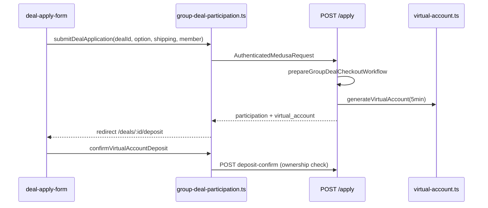

# Group Buying Site — 프로젝트 현황 및 기술 문서

> **작성 기준일:** 2026-07-20 (최초 2026-07-15, 2026-07-18 갱신)  
> **저장소:** [github.com/yjj0066/group_buying](https://github.com/yjj0066/group_buying)  
> **경로:** `group-buying-site/` (pnpm monorepo)  
> **스택:** Medusa v2.17.2 (`@dtc/backend`) + Next.js 15.5.18 (`@dtc/storefront`)  
> **기준 스펙:** Excel v3 (`_spec_extract_v3.txt`)  
> **관련 문서:** [README.md](./README.md) · [CODE_ANALYSIS.md](./CODE_ANALYSIS.md)

---

## 1. 프로젝트 개요

K-POP 굿즈(앨범, 응원봉, 포토카드 등)를 대상으로 **총대(리더) 중심의 공동구매(Group Deal)** 를 운영하는 이커머스 플랫폼이다.

**결제·통화 정책:**

| 항목 | 정책 |
|------|------|
| **통화** | **KRW(원화) 전용** — 상단 통화 선택 UI 제거 (2026-07-20) |
| **v3 가상계좌** | join/apply → VA 발급 → `/deposit` 입금 안내 (5분 홀드, stub 자동 확인) |
| **PG 에스크로** | join → cart → checkout → Toss / Stripe → minimum_reached 일괄 캡처 (해외 PG, 현재 UI는 KRW 중심) |

**하이브리드 AI (Flask, 선택):** Medusa는 결제·주문·재고·**공동구매 검색**을 담당하고, Flask는 **레거시 상품 검색(`/store?q=`)·추천·행동 로그**만 담당한다. 로컬 dev에서는 Flask **기본 OFF** (`SEARCH_API_ENABLED=false`).

**메인 쇼핑 진입점 (2026-07-20):**

| UI | URL | 비고 |
|----|-----|------|
| Nav **공동구매** | `/kr/group-buying` | SRCH 필터·카탈로그 |
| **헤더 돋보기** | `/kr/group-buying?q=` | 공동구매와 동일 (이전: `/store?q=`) |
| 레거시 상품 | `/kr/store?q=` | Flask semantic search (선택) |

### 1.1 2026-07-15 변경 요약

| 구분 | 내용 |
|------|------|
| **P2** | HOME-03 (최애 랜딩), DASH-05 (AI 단가 추천), MTRS-01 (신뢰·후기) |
| **P0/P1** | OPEN 상태 통일, CHKO VA, HOME-01 redirect, MYJN 후기/분쟁/D+7, 정산 API |
| **성능** | Flask dev OFF, 800ms timeout, Turbopack, middleware 2s |
| **운영** | Admin SDK 401 수정, API route import path 수정 |

### 1.2 2026-07-18 변경 요약

| 구분 | 내용 |
|------|------|
| **GB App UI** | `(gb-app)` — 참여자 7단계, 총대 10단계, 마이 9화면 |
| **온보딩** | splash → login → signup → bank-account → `/home` |
| **INP 최적화** | debounce 200ms, React.memo 카드, optimistic mode switch |
| **버그 수정** | `[id]`/`[participantId]` slug 충돌, settlement import |

### 1.3 2026-07-20 변경 요약

| 구분 | 내용 |
|------|------|
| **상단 검색** | `ProductSearch` → `buildGroupBuyingSearchPath` → `/group-buying?q=` |
| **KRW-only** | `CurrencySelectSlot`·`currency-select/`·`currency-options.ts` 삭제 |
| **로그인 UI** | `SubmitButton variant="primary"` — 보라색 CTA 가시성 |
| **SRCH 필터** | 아이돌 그룹(검색형), 굿즈 종류(4종), 가격 범위(슬라이더+입력), URL 동기화 |
| **apply API** | `POST /store/group-deals/:id/apply` + `group-deal-participation.ts` server actions |
| **MYJN 목록** | `listMyParticipations` 빈 배열 반환 수정, deposit-confirm 소유권 검증 |
| **총대 개설** | 날짜 ISO 정규화, extra field 매핑, `seed:group-buy-demo-product` |

---

## 2. 현재까지 구현된 핵심 기능

### 2.1 백엔드 — 공동구매 도메인 모듈

| 영역 | 구현 내용 |
|------|-----------|
| **커스텀 모듈** | `src/modules/group-buying/` — `GroupBuyingModuleService` |
| **데이터 모델** | `GroupDeal`, `GroupDealOption`, `GroupDealParticipant`, `GroupDealParticipantSelection`, `GroupDealWaitlistEntry` |
| **상태 머신** | `GroupDealStatus` — `OPEN` canonical (ACTIVE 제거) |
| **참여 규칙** | `assertDealJoinable`, `evaluateDealStatus`, slot/waitlist |
| **총대 신뢰·단가** | `leader-trust-profile.ts`, `group-deal-price-recommendations.ts` |
| **가상계좌** | `utils/virtual-account.ts` — CHKO stub VA |
| **직렬화** | `group-deal-store.ts`, `group-deal-account.ts` — MYJN stage, metadata shipping/member |
| **검증 오류** | `format-group-deal-validation-error.ts` — 사용자 친화 메시지 |
| **D+7 자동 수령** | `autoConfirmOverdueDeliveries()` + cron |

### 2.2 백엔드 — 결제·에스크로

| 영역 | 구현 내용 |
|------|-----------|
| **토스페이먼츠** | `src/modules/toss-payments/` |
| **Stripe 공동구매** | `src/modules/stripe-group-deal/` |
| **Join + VA** | `POST .../join` — VA, deposit path, 5분 deadline |
| **Apply + VA** | **`POST .../apply`** — 인증, APLY 폼 필드, VA (2026-07-20) |
| **입금 확인** | `POST .../deposit-confirm` — stub + **customer ownership check** |
| **총대 보증금** | `POST /store/me/group-deals/:id/deposit` |

### 2.3 백엔드 — Store API (`/store`)

| Method | 경로 | 설명 | 상태 |
|--------|------|------|------|
| GET | `/store/group-deals` | 목록 | 완료 |
| GET | `/store/group-deals/:id` | 상세 + options | 완료 |
| POST | `/store/group-deals/:id/join` | 참여 → VA (레거시) | 완료 |
| **POST** | **`/store/group-deals/:id/apply`** | **참여 신청 (인증) → VA** | **완료 (2026-07-20)** |
| POST | `/store/group-deals/:id/deposit-confirm` | VA 입금 확인 | stub + ownership |
| POST | `/store/group-deals/:id/waitlist` | 대기열 | 완료 |
| GET | `/store/products/search-index` | Flask 색인 피드 | 완료 |

**인증 `/store/me`:**

| Method | 경로 | 설명 | 스펙 |
|--------|------|------|------|
| GET | `/store/me/group-deals/participations` | 참여 목록 | MYJN |
| GET | `/store/me/group-deals/hosted` | 총대 공구 목록 | DASH |
| POST | `/store/me/group-deals/:id/deposit` | 총대 보증금 | CRTE |
| POST | `/store/me/group-deals/participations/:id/review` | 후기 | MYJN-05 |
| POST | `/store/me/group-deals/participations/:id/dispute` | 분쟁 | MYJN-06 |
| POST | `/store/me/group-deals/participations/:id/confirm-delivery` | 수령 확인 | MYJN |
| GET | `/store/me/trust-profile` | 총대 신뢰 | MTRS-01 |
| GET/POST | `/store/me/bank-account` | 환불 계좌 | ACCT-01 |
| GET/PUT | `/store/me/preferences` | 최애·역할 | MALM |

미들웨어: `api/store/me/middlewares.ts`, `api/store/group-deals/middlewares.ts`

### 2.4 백엔드 — 총대 공구 개설 (2026-07-20)

| 항목 | 구현 |
|------|------|
| **날짜 필드** | `expected_ship_date` ISO datetime 수용 |
| **Extra fields** | `member_seats` → options, `idol_group`/`goods_type` → metadata |
| **데모 상품** | `pnpm seed:group-buy-demo-product` |
| **공유 상수** | `group-buying-demo-product.ts` |

### 2.5 백엔드 — 워크플로우·Cron

| 구성요소 | 동작 |
|----------|------|
| `prepareGroupDealCheckoutWorkflow` | join/apply 공통 — slot + participant + VA |
| `captureGroupDealPaymentsWorkflow` | minimum_reached 캡처 |
| `group-deal-maintenance` | 미결제 만료, CLOSED, D+7 auto-confirm |

### 2.6 Flask 하이브리드 AI (선택)

| 용도 | 경로 | 비고 |
|------|------|------|
| **상품 검색** | `/store?q=` | Flask 전용, dev OFF 기본 |
| **추천·로그** | BFF `/api/ai/*` | fire-and-forget |
| **공동구매 검색** | `/group-buying?q=` | **Medusa + client filter (Flask 미사용)** |

---

### 2.7 스토어프론트 — 네비게이션·검색 (2026-07-20)

| 구성요소 | 파일 | 설명 |
|----------|------|------|
| **헤더 검색** | `product-search/` | **`buildGroupBuyingSearchPath` → `/group-buying?q=`** |
| **Nav 공동구매** | `nav/index.tsx` | `/group-buying` 링크 |
| **통화 선택** | *(삭제)* | KRW-only — `currency-select/` 제거 |
| **언어 전환** | `language-switcher/` | 6개 로케일 유지 |
| **로그인** | `account/components/login/` | primary CTA 버튼 |

### 2.8 스토어프론트 — 공동구매 SRCH (2026-07-20)

| 구성요소 | 파일 | 설명 |
|----------|------|------|
| **필터 바** | `search-filter-bar/` | 아이돌·굿즈·가격 pill UI |
| **가격 필터** | `price-range-filter/` | 듀얼 슬라이더 + min/max 입력 |
| **필터 매칭** | `group-buying-filter-match.ts` | idol partial match, goods alias |
| **URL 동기화** | `group-deal-filter-url.ts`, `use-group-deal-search.ts` | `q`, `group`, `goods`, `minPrice`… |
| **카탈로그** | `group-deals-catalog/` | draft vs applied filters, memo results |
| **상수** | `group-buying-catalog.ts` | IDOL_GROUP_SUGGESTIONS, GOODS_TYPE_OPTIONS |

**굿즈 종류 (총대 개설과 동일):** 앨범, 포토카드, 응원봉, MD 세트

### 2.9 스토어프론트 — 참여·입금 (2026-07-20)

| 구성요소 | 파일 | 설명 |
|----------|------|------|
| **참여 신청** | `deal-apply-form/` | → `submitDealApplication` |
| **입금** | `deal-deposit-flow/` | → `confirmVirtualAccountDeposit` |
| **Server Actions** | **`group-deal-participation.ts`** | apply, deposit-confirm, cancel |
| **내 참여** | `account-group-deals.ts` | `listMyParticipations` — empty `[]` OK |
| **Mock 정책** | `persistence-policy.ts` | `NEXT_PUBLIC_ENABLE_MOCK_FALLBACK=true`일 때만 fallback |

### 2.10 스토어프론트 — GB App `(gb-app)`

| # | Wireframe | 경로 | 상태 |
|---|-----------|------|------|
| 1 | HOME/SRCH | `/kr/home`, `/kr/search` | **완료** |
| 2 | DETL | `/kr/deals/[dealId]` | **완료** |
| 3 | APLY | `/kr/deals/[dealId]/apply` | **완료** (apply API 연동) |
| 4 | CHKO | `/kr/deals/[dealId]/deposit` | **완료** |
| 5 | DONE | `/kr/deals/[dealId]/complete` | **완료** |
| 6 | MYJN | `/kr/participations/[participantId]` | **완료** |
| 7 | RPTB | `/kr/my/participations/[participantId]/review` | **완료** |
| 8–10 | 총대 10단계 | `/kr/seller/*` | **UI 완료** |

**GB App vs 레거시:**

| 기능 | GB App | 레거시 (main) |
|------|--------|---------------|
| 목록·검색 | `/kr/home`, `/kr/search` | **`/kr/group-buying`** (메인 SRCH) |
| 상세 | `/kr/deals/[dealId]` | `/kr/group-buying/[id]` |
| 마이 | `/kr/my/*` | `/kr/account/*` |

### 2.11 스토어프론트 — 랜딩·마이·DASH·MTRS

| 영역 | 상태 |
|------|------|
| HOME-01 역할 redirect | 완료 |
| HOME-03 최애 랜딩 + AI slider | 완료 |
| MTRS trust-reviews | 완료 |
| DASH AI 단가 추천 | 완료 (환불 자동화 미완) |
| MYJN 후기·분쟁·D+7 | 완료 |

### 2.12 개발 성능 (2026-07)

| 항목 | 설정 |
|------|------|
| Flask dev OFF | `SEARCH_API_ENABLED=false` |
| Flask timeout | dev 800ms |
| Turbopack | `next dev --turbopack` |
| GB App debounce | 200ms |
| Card memo | React.memo |
| Mode switch | optimistic UI |

---

## 3. 프로젝트 구조

```
group-buying-site/
├── README.md
├── PROJECT_STATUS.md          ← 본 문서
├── CODE_ANALYSIS.md
├── apps/
│   ├── backend/
│   │   └── src/
│   │       ├── modules/group-buying/
│   │       ├── api/store/group-deals/
│   │       │   ├── [id]/join/route.ts
│   │       │   ├── [id]/apply/route.ts      # 2026-07-20
│   │       │   └── [id]/deposit-confirm/route.ts
│   │       ├── api/store/me/group-deals/
│   │       ├── scripts/seed-group-buy-demo-product.ts
│   │       └── utils/format-group-deal-validation-error.ts
│   └── storefront/
│       └── src/
│           ├── app/[countryCode]/
│           │   ├── (gb-app)/
│           │   └── (main)/group-buying/     # 메인 SRCH
│           ├── lib/
│           │   ├── util/group-deal-filter-url.ts
│           │   ├── util/group-buying-filter-match.ts
│           │   ├── data/group-deal-participation.ts
│           │   └── util/normalize-draft-date-to-iso-datetime.ts
│           └── modules/
│               ├── layout/components/product-search/
│               └── group-buying/components/
│                   ├── search-filter-bar/
│                   └── price-range-filter/
```

---

## 4. 핵심 로직 흐름

### 4.1 v3 참여 — Apply 경로 (2026-07-20, GB App 기본)



### 4.2 v3 참여 — Join 경로 (레거시)

```
POST /store/group-deals/:id/join
  → VA + checkout_path → /group-buying/:id/deposit
  → deposit-confirm stub
```

### 4.3 SRCH — 헤더 검색 + 필터 (2026-07-20)

```
ProductSearch submit
  └── buildGroupBuyingSearchPath(countryCode, query)
        └── /kr/group-buying?q=blackpink

GroupDealsCatalog
  ├── parseFiltersFromSearchParams (URL → appliedFilters)
  ├── SearchFilterBar (idol, goods, price pills)
  ├── useGroupDealSearch (draft → apply → URL replace)
  └── filterGroupDeals(deals, appliedFilters)
        ├── matchesQuery (title, idol_group, member)
        ├── matchesIdolGroupFilter (partial)
        ├── matchesGoodsTypeFilter (alias: photocard→포토카드)
        └── price range [minPrice, maxPrice]
```

### 4.4 MYJN — 내 참여 목록 (2026-07-20 수정)

```
GET /store/me/group-deals/participations
  └── listMyParticipations()
        └── return response.participations ?? []   // empty [] OK (이전: mock만 표시 버그)
```

### 4.5 총대 공구 개설 (2026-07-20)

```
Leader create wizard submit
  ├── normalizeDraftDateToIsoDateTime(expected_ship_date)
  ├── POST /store/me/group-deals
  │     ├── validator: member_seats, idol_group, goods_type
  │     └── route: options + metadata mapping
  └── format-group-deal-validation-error (사용자 메시지)
```

### 4.6 GB App — 온보딩 · 홈

```
GET /kr/home
  ├── requireCustomerForGbApp()
  ├── loadHomeDashboardData()
  └── HomeModeDashboard (participant | leader mode)
```

---

## 5. v3 Excel 스펙 대비 구현 현황

### 5.1 구현 완료

| ID | 항목 | 구현 위치 |
|----|------|-----------|
| **SRCH (main)** | **필터·URL·헤더 검색** | `search-filter-bar`, `group-deal-filter-url`, `product-search` |
| **APLY (API)** | **참여 신청 POST** | **`apply/route.ts`, `group-deal-participation.ts`** |
| **MYJN list** | **내 참여 관리** | `listMyParticipations` fix |
| CHKO-01/03 | VA UI, 5분 deadline | deposit flow, join/apply |
| MYJN-02~07 | 타임라인·후기·분쟁·D+7 | participation API + cron |
| MTRS-01 | 신뢰·후기 | leader-trust-profile |
| DASH-05 | AI 단가 추천 | price-rec utils + panel |
| HOME-01/03 | 역할 redirect, 최애 랜딩 | landing + GB App home |
| GB App | DETL→DONE, 총대 10단계, 마이 9화면 | `(gb-app)/*` |
| **KRW-only UI** | **통화 선택 제거** | nav, currency-select 삭제 |

### 5.2 부분 구현

| ID | 항목 | 현황 |
|----|------|------|
| CHKO-02 | 입금 자동 확인 | deposit-confirm stub — webhook 없음 |
| CHKO-03 (서버) | seat lock API | 클라이언트 5분만 |
| DASH-05 | 가격 인하 환불 | apply API만 — refund workflow 없음 |
| MTRS | 후기 저장 | deal metadata 배열 |
| Document AI | Upstage OCR | stub |
| Dual routes | gb-app + main | 이중 유지보수 |
| i18n GB cards | ja/es/zh/ru | partial labels |

### 5.3 미구현

| ID | 항목 |
|----|------|
| OPEN-01~03 | 개봉 전용 운영 UI |
| LGN-02, ACCT-02 | 소셜 로그인, 실명 인증 |
| LIVE-01 | WebSocket 실시간 동기화 |
| STLM | Flask 정산 이식 |
| Route consolidation | group-buying vs deals 단일화 |
| SRCH server pagination | client-side filter only |

---

## 6. 설치 및 실행

### 6.1 사전 요구사항

- Node.js >= 20, pnpm 10.x, PostgreSQL 15+
- (선택) Flask — `/store` 검색용

### 6.2 환경 변수

**Storefront** (`apps/storefront/.env.local`):

```env
NEXT_PUBLIC_MEDUSA_PUBLISHABLE_KEY=pk_...
NEXT_PUBLIC_MEDUSA_BACKEND_URL=http://localhost:9000
NEXT_PUBLIC_DEFAULT_REGION=kr
SEARCH_API_ENABLED=false
NEXT_PUBLIC_SEARCH_API_URL=http://localhost:5000
# NEXT_PUBLIC_ENABLE_MOCK_FALLBACK=true   # mock fallback (기본 OFF)
```

### 6.3 시드·개발 서버

```bash
pnpm install
cd apps/backend
pnpm db:migrate
pnpm medusa user -e admin@test.com -p supersecret
pnpm seed:locales && pnpm seed:regions && pnpm seed:korea-toss && pnpm seed:stripe
pnpm seed:group-buy-demo-product   # 총대 개설용 데모 상품

pnpm dev   # backend :9000 + storefront :8000
```

| URL | 확인 |
|-----|------|
| http://localhost:8000/kr/group-buying | **메인 SRCH (비로그인 OK)** |
| http://localhost:8000/kr/group-buying?q=blackpink | **헤더 검색 결과** |
| http://localhost:8000/kr/home | GB App (로그인 필요) |
| http://localhost:8000/kr/deals/{dealId}/apply | APLY (로그인) |
| http://localhost:8000/kr/store?q=bts | Flask 상품 검색 (선택) |

### 6.4 트러블슈팅

| 증상 | 해결 |
|------|------|
| **상단 검색이 `/store`로 이동** | 최신 코드 — `/group-buying?q=` 확인 |
| **내 참여 관리 비어 있음** | 로그인 확인, apply API·백엔드 재시작 |
| **공구 개설 검증 오류** | `pnpm seed:group-buy-demo-product`, 날짜·멤버·굿즈 확인 |
| **`'id' !== 'participantId'`** | stale `[id]/` 삭제, dev 재시작 |
| **하얀 화면 / 500** | slug/import fix 후 storefront dev 재시작 |
| Error -102 (Admin) | backend `:9000` 기동 |
| Flask 검색 없음 | `SEARCH_API_ENABLED=true` + Flask `:5000` (상품 `/store` 전용) |

---

## 7. 현재 한계점 및 향후 과제 (To-Do)

### 7.1 v3 스펙 · 결제

| 항목 | 현황 | 다음 단계 |
|------|------|-----------|
| ~~GB App apply API~~ | **완료 (2026-07-20)** | E2E 테스트 추가 |
| CHKO-02 | deposit-confirm stub | 은행/PG webhook |
| CHKO-03 서버 | client 5min only | server-side seat hold API |
| DASH-05 refund | apply만 | participant 환불 workflow |
| VA custody | stub + PG 병존 | production adapter |

### 7.2 SRCH · UX

| 항목 | 현황 | 다음 단계 |
|------|------|-----------|
| ~~헤더 검색 → group-buying~~ | **완료** | — |
| ~~SRCH 필터 UI~~ | **완료** | — |
| ~~KRW-only~~ | **완료** | — |
| Server pagination | client filter | backend filter API |
| Route consolidation | gb-app + main | 단일 route tree |

### 7.3 MTRS · DASH · 운영

| 항목 | 현황 | 다음 단계 |
|------|------|-----------|
| MTRS reviews | metadata | Review 엔티티 |
| Document AI | stub | Upstage BFF |
| E2E tests | unit 9개 | apply→deposit→MYJN flow |
| 알림 | metadata log | SendGrid/Firebase |

### 7.4 완료된 과제 (2026-07-20)

| 항목 | 완료일 |
|------|--------|
| apply API + server actions | 2026-07-20 |
| MYJN list empty array fix | 2026-07-20 |
| Header search → group-buying | 2026-07-20 |
| Currency selector removal | 2026-07-20 |
| SRCH filter bar + URL sync | 2026-07-20 |
| Group deal create validation | 2026-07-20 |
| GB App frontend | 2026-07-18 |
| ACTIVE → OPEN | 2026-07-15 |
| MYJN-07 D+7 cron | 2026-07-15 |

---

## 8. 주요 파일 인덱스

### Backend — 2026-07-20

| 파일 | 역할 |
|------|------|
| **`api/store/group-deals/[id]/apply/route.ts`** | GB App 참여 신청 API |
| `api/store/group-deals/[id]/deposit-confirm/route.ts` | VA confirm + ownership |
| `api/store/group-deals/middlewares.ts` | apply route auth |
| `api/store/me/group-deals/route.ts` | create + field mapping |
| `utils/format-group-deal-validation-error.ts` | validation messages |
| `scripts/seed-group-buy-demo-product.ts` | demo product seed |

### Storefront — 2026-07-20

| 파일 | 역할 |
|------|------|
| **`lib/data/group-deal-participation.ts`** | apply/deposit server actions |
| **`lib/util/group-deal-filter-url.ts`** | URL filters + `buildGroupBuyingSearchPath` |
| **`lib/util/group-buying-filter-match.ts`** | idol/goods match + aliases |
| `lib/util/normalize-draft-date-to-iso-datetime.ts` | create date fix |
| `lib/constants/group-buying-catalog.ts` | idol/goods constants |
| **`modules/layout/components/product-search/`** | header search → group-buying |
| **`modules/group-buying/components/search-filter-bar/`** | SRCH pill filters |
| **`modules/group-buying/components/price-range-filter/`** | price slider + input |
| `modules/group-buying/hooks/use-group-deal-search.ts` | URL-synced filters |
| `modules/account/components/login/` | primary login button |
| `lib/data/account-group-deals.ts` | `listMyParticipations` fix |

### Storefront — GB App (2026-07-18)

| 파일 | 역할 |
|------|------|
| `lib/wireframe/routes.ts` | GB App URL registry |
| `lib/hooks/use-debounced-value.ts` | debounce 200ms |
| `(gb-app)/layout.tsx` | tab bar + mode provider |
| `deal-apply-form/`, `deal-deposit-flow/` | APLY, CHKO |

---

## 부록 — 환경 변수

| 변수 | 용도 |
|------|------|
| `NEXT_PUBLIC_MEDUSA_PUBLISHABLE_KEY` | Store API |
| `SEARCH_API_ENABLED` | Flask (`/store` 검색, dev OFF) |
| `NEXT_PUBLIC_ENABLE_MOCK_FALLBACK` | mock fallback (기본 OFF) |
| `FLASK_REQUEST_TIMEOUT_MS` | Flask timeout (dev 800) |
| `DATABASE_SSL` | Supabase |

---

## 부록 — API Route Import Depth

| Route 위치 (from `src/api/`) | `../` count |
|------------------------------|-------------|
| `store/group-deals/[id]/apply/` | **6** |
| `store/me/group-deals/[id]/deposit/` | 6 |
| `store/me/group-deals/participations/[id]/review/` | 7 |

상세: [CODE_ANALYSIS.md §3.8](./CODE_ANALYSIS.md)

---

*본 문서는 `group-buying-site` 코드베이스 실제 파일·API·워크플로우를 기준으로 작성되었습니다 (2026-07-20 갱신). 코드 레벨 분석은 [CODE_ANALYSIS.md](./CODE_ANALYSIS.md), 사용자-facing 요약은 [README.md](./README.md)를 참고하세요.*
