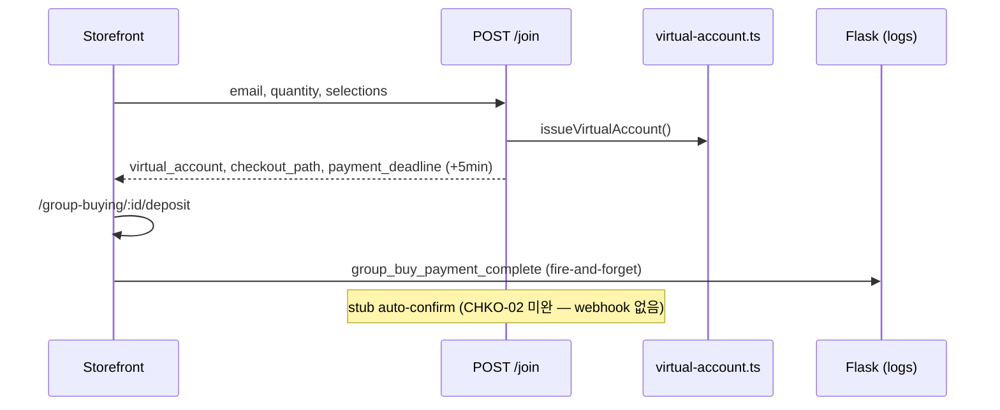
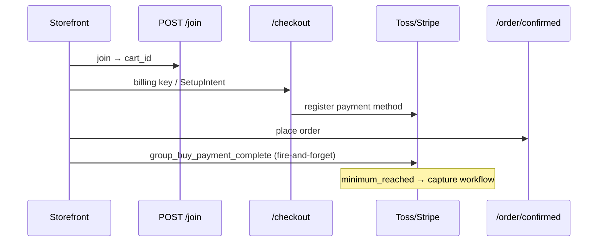

# Group Buying Site — 프로젝트 현황 및 기술 문서

> **작성 기준일:** 2026-07-15  
> **저장소 경로:** `group-buying-site/` (pnpm monorepo)  
> **스택:** Medusa v2.17.2 (`@dtc/backend`) + Next.js 15.5.18 (`@dtc/storefront`)  
> **기준 스펙:** Excel v3 (`_spec_extract_v3.txt`) + v2 (`_spec_extract_v2.txt`)  
> **요약 README:** [README.md](./README.md)

---

## 1. 프로젝트 개요

K-POP 굿즈(앨범, 응원봉, 포토카드 등)를 대상으로 **총대(리더) 중심의 공동구매(Group Deal)** 를 운영하는 이커머스 플랫폼이다.

**결제 모델 (이중 경로):**

| 경로 | 설명 |
|------|------|
| **v3 가상계좌** | join → VA 발급 → `/deposit` 입금 안내 (5분 홀드, stub 자동 확인) |
| **PG 에스크로** | join → cart → checkout → Toss 빌링키 / Stripe SetupIntent → minimum_reached 일괄 캡처 |

**하이브리드 AI (Flask):** Medusa는 결제·주문·재고만 담당하고, Flask는 **검색·추천·행동 로그**만 담당한다. Flask 장애 시 검색/추천 UI는 숨김 처리되며, 장바구니·결제 UX는 영향받지 않는다.

---

## 2. 현재까지 구현된 핵심 기능

### 2.1 백엔드 — 공동구매 도메인 모듈

| 영역 | 구현 내용 |
|------|-----------|
| **커스텀 모듈** | `src/modules/group-buying/` — `GroupBuyingModuleService` |
| **데이터 모델** | `GroupDeal`, `GroupDealOption`, `GroupDealParticipant`, `GroupDealParticipantSelection`, `GroupDealWaitlistEntry` |
| **상태 머신** | `GroupDealStatus` (`DRAFT`, `OPEN`, `MINIMUM_REACHED`, `CLOSED`, `SETTLED` 등), `GroupDealParticipantStatus`, `GroupDealDepositStatus` |
| **상태 정합성** | 잘못된 `ACTIVE` 참조 제거 → **`OPEN`으로 통일** (`group-deal-maintenance.ts` 등) |
| **참여 규칙** | `assertDealJoinable`, `evaluateDealStatus`, `countUniqueCommittedParticipants` |
| **옵션/1차금** | `resolveParticipantQuantity`, `computeFirstPaymentAmount`, `assertSelectionsWithinLimits` |
| **리더 통계** | `group-deal-leader-stats.ts` — `leader_role_number`, `is_first_time_leader` |
| **가상계좌** | `utils/virtual-account.ts` — CHKO stub VA 생성 |
| **문서 AI stub** | `utils/document-extract-stub.ts` — 영수증 구조화 필드 추출 |
| **직렬화** | `group-deal-store.ts` — `opening` 타임라인, `declared_album_quantity`, `purchase_receipt_structured` |
| **참여 단계** | `group-deal-account.ts` — `opening` participation/leader stage |

### 2.2 백엔드 — 결제·에스크로·빌링

| 영역 | 구현 내용 |
|------|-----------|
| **토스페이먼츠 PG** | `src/modules/toss-payments/` — 빌링키 등록·캡처·환불 |
| **Stripe 공동구매 PG** | `src/modules/stripe-group-deal/` — SetupIntent 예약 결제 |
| **한국 PG (일반 결제)** | `src/modules/korean-pg-payment/` |
| **에스크로 해제** | `GroupDealEscrowService.releaseParticipantEscrow()` |
| **빌링 캡처** | `createGroupDealBillingCaptureService()` |
| **Join + VA** | `POST .../join` — `virtual_account`, `checkout_path` → deposit 페이지, `payment_deadline` **5분** |

### 2.3 백엔드 — 워크플로우

| 워크플로우 | 역할 |
|------------|------|
| `prepareGroupDealCheckoutWorkflow` | 참여 슬롯 예약 → 카트/VA 생성 → 1차금 산출 |
| `captureGroupDealPaymentsWorkflow` | minimum_reached 후 RESERVED 일괄 캡처 |
| `processOverdueParticipantsWorkflow` | 입금 기한 초과 슬롯 해제 |
| `confirmParticipantDeliveryWorkflow` | 수령 확인 → 정산 |
| `vacateParticipantSlot` + waitlist | 공석 → `matchWaitlistEntry` |
| `joinDemandSurveyWorkflow` | 수요조사 참여 |

### 2.4 백엔드 — Store API (`/store`)

| Method | 경로 | 설명 |
|--------|------|------|
| GET | `/store/group-deals` | 목록 (`?navigation=true` — deposit 필터 완화) |
| GET | `/store/group-deals/:id` | 상세 + options + leader stats |
| GET | `/store/group-deals/by-product/:productId` | 상품별 연결 공구 |
| POST | `/store/group-deals/:id/join` | 참여 → VA + deposit path |
| POST | `/store/group-deals/:id/waitlist` | 대기열 |
| GET | `/store/products/search-index` | Flask 색인 피드 |

**인증 `/store/me`:**

| Method | 경로 | 설명 |
|--------|------|------|
| GET/POST | `/store/me/bank-account` | 환불 계좌 (ACCT-01) |
| GET/PUT | `/store/me/preferences` | 알림·최애·`preferred_role` |
| POST | `/store/me/group-deals/:id/urgent-fill` | 긴급 모집 (QFIL) |
| POST | `/store/me/group-deals/participations/:id/review` | 후기 (MYJN-05) |
| POST | `/store/me/group-deals/participations/:id/dispute` | 분쟁 (MYJN-06) |
| GET | `/store/me/group-deals/participations` | 참여 목록 |
| POST | `/store/me/group-deals/participations/:id/confirm-delivery` | 수령 확인 |
| GET | `/store/me/group-deals/hosted` | 총대 공구 |
| GET | `/store/me/group-deals/settlements` | 정산 |
| GET/POST/DELETE | `/store/me/payment-methods` | 결제수단 CRUD |

인증 미들웨어: `api/store/me/middlewares.ts`

### 2.5 백엔드 — Admin API 및 대시보드 UI

| 영역 | 경로 |
|------|------|
| **Admin REST** | CRUD, capture, settle, cancel, receipt, tracking 등 |
| **영수증** | `POST/GET admin/group-deals/:id/receipt` — AI stub 추출 + 자동 검증 |
| **Admin SDK** | `admin/lib/sdk.ts` + `admin-fetch.ts` — Medusa JS SDK JWT (**401 수정**) |
| **Admin UI** | `src/admin/routes/group-deals/` — CRUD, LeaderManagementPanel |

### 2.6 백엔드 — 이벤트·스케줄러

| 구성요소 | 동작 |
|----------|------|
| `group-deal-minimum-reached-capture` | minimum_reached → 일괄 캡처 |
| `order-placed-group-deal` | 주문 완료 → 참여 상태 갱신 |
| `group-deal-notifications` | metadata `notification_log` 기록 |
| `group-deal-maintenance` | 미결제 만료 + `ends_at` 경과 `CLOSED` (`OPEN`/`MINIMUM_REACHED` 기준) |

### 2.7 백엔드 — 단위 테스트

`src/utils/__tests__/` — 9개 spec (rules, options, escrow, store, admin-rules, deposit-guards, toss, webhook 등)

---

### 2.8 Flask 하이브리드 AI (Partner ↔ Practice)

| 영역 | 파일/경로 | 설명 |
|------|-----------|------|
| **설정** | `lib/config/flask-search.ts` | `NEXT_PUBLIC_SEARCH_API_URL`, `AI_ENGINE_URL` |
| **검색** | `lib/data/flask-search.ts` | `GET /api/v1/products/search` — semantic + keyword 병합 |
| **추천** | `lib/data/ai-engine.ts` | landing / similar context |
| **하이드레이션** | `lib/data/hydrate-recommended-products.ts` | Flask ID → Medusa 상품 |
| **행동 로그 (서버)** | `lib/data/flask-behavior-log.ts` | Flask forward (non-blocking) |
| **행동 로그 (클라)** | `lib/util/flask-behavior-log.ts` | fire-and-forget `track*` |
| **BFF** | `app/api/ai/search`, `recommendations`, `events` | Next.js API Routes |
| **색인 피드** | `GET /store/products/search-index` | Medusa → Flask 동기화 |

**Flask API 계약:** [docs/api-contract-for-merge.md](./docs/api-contract-for-merge.md)

---

### 2.9 스토어프론트 — Flask 검색·추천·로그

| 구성요소 | 파일 | 설명 |
|----------|------|------|
| **검색바** | `modules/layout/components/product-search/` | `/{country}/store?q=` |
| **검색 결과** | `modules/store/templates/paginated-products.tsx` | Flask 전용, `FlaskSearchMeta` (동의어·모델) |
| **상품 카드** | `modules/products/components/product-preview/` | 검색 클릭 로그 optional props |
| **AI 추천 슬라이더** | `modules/products/components/ai-recommendation-slider/` | 비동기 BFF fetch, 가로 스크롤 |
| **랜딩 배치** | `landing-page-client.tsx` | Hero 아래 `context=landing` |
| **상세 배치** | `group-deal-detail/index.tsx` | 하단 `context=similar` |
| **행동 로그** | `modules/common/components/flask-behavior-logger/` | 주문 완료·VA deposit |
| **주문 완료** | `order/templates/order-completed-template.tsx` | 공구 주문 시 로그 |
| **장바구니** | `product-actions/index.tsx` | addToCart 성공 후 로그 |

**행동 이벤트:**

| event_type | 트리거 | Flask |
|------------|--------|-------|
| `search_click` | 검색 결과 카드 클릭 | `POST /api/v1/products/search/click` |
| `add_to_cart` | 공동구매 참여 → 장바구니 | `POST /api/v1/events` |
| `group_buy_payment_complete` | order confirmed / VA deposit | `POST /api/v1/events` |

---

### 2.10 스토어프론트 — 랜딩 (`(landing)`)

| 구성요소 | 파일 |
|----------|------|
| **페이지** | `(landing)/page.tsx` → `LandingPageTemplate` |
| **Nav** | `landing-nav` — 로그인/마이페이지 분기, `whitespace-nowrap` |
| **데이터** | `lib/util/landing-deals.ts` — API + `MOCK_DEALS` 폴백 |
| **AI 추천** | `AiRecommendationSlider` (landing context) |
| **섹션** | Hero, Popular, Categories, Grid, Ending Soon, Trending 등 |
| **i18n** | 6개 로케일 + `landing-shared.ts` |

---

### 2.11 스토어프론트 — 공동구매 (SRCH / DETL / CHKO)

| 구성요소 | 파일 | v3 스펙 |
|----------|------|---------|
| **목록·필터** | `group-deals-catalog`, `group-deal-filters` | SRCH, QFIL-03 긴급 필터/배지 |
| **상세 템플릿** | `group-deal-detail/` | DETL |
| **타임라인** | `group-deal-timeline/` | DETL-04 — 7단계 (`opening` 포함) |
| **총대 신뢰** | `leader-trust-panel/` | TRST — 첫 공구/경험 분기, `leader_role_number` |
| **영수증** | `purchase-receipt-panel/` | DETL-03 — 구조화 필드 표시 |
| **참여** | `join-deal-form/` | → deposit redirect (CHKO) |
| **가상계좌** | `virtual-account-deposit/` | CHKO-01 UI, 5분 카운트다운 |
| **입금 페이지** | `group-buying/[id]/deposit/page.tsx` | CHKO |
| **멤버 자리** | `member-seat-picker/` | DETL 자리 선택 |
| **참여 타임라인** | `participation-timeline/` | MYJN-02 — `opening` stage |

---

### 2.12 스토어프론트 — 마이페이지 (`/account`)

| 라우트 | 컴포넌트 | v3 스펙 |
|--------|----------|---------|
| `/account` | `AccountOverview`, `RoleSwitcher` | HOME-02 |
| `/account/bank-account` | `BankAccountForm` | ACCT-01 |
| `/account/preferences` | `PreferencesForm` (+ `preferred_role`) | MALM, SGN |
| `/account/payment-methods` | `PaymentMethodsPanel` | MPAY |
| `/account/group-deals/hosted` | `HostedDealsList`, `GroupDealCreateForm` | CRTE-03 `declared_album_quantity` |
| `/account/group-deals/hosted/[id]/report` | 리포트 스텁 | RPT-05 |
| `/account/group-deals/participations` | `ParticipationsList` | MYJN |
| `/account/group-deals/participations/[id]` | 후기·분쟁·추적 링크 | MYJN-03/05/06 |
| `/account/settlements` | `SettlementsTable` | MSTL |
| `/account/forgot-password` | 스텁 | LGN-03 |
| `/account/customer-service` | FAQ 스텁 | MCS-01 |

서버 액션: `lib/data/account-group-deals.ts` — bank-account, review, dispute, preferences 등

---

### 2.13 스토어프론트 — 상품·스토어

| 구성요소 | 설명 |
|----------|------|
| `/store?q=` | Flask semantic 검색 (Medusa `q` fallback 없음) |
| `/products/[handle]` | 공구 redirect 또는 DETL 미리보기 + 유사 추천 |
| `product-actions` | 수요조사/공구 참여, 장바구니 + 행동 로그 |
| `/order/[id]/confirmed` | 주문 완료 + 공구 결제 로그 |

---

## 3. 프로젝트 구조

```
group-buying-site/
├── README.md
├── PROJECT_STATUS.md          ← 본 문서
├── DEPLOYMENT.md
├── docs/
│   ├── domain-contract-for-merge.md
│   └── api-contract-for-merge.md
├── _spec_extract_v3.txt
├── _spec_extract_v2.txt
├── apps/
│   ├── backend/
│   │   └── src/
│   │       ├── modules/group-buying/
│   │       ├── api/store/group-deals/, me/, products/search-index/
│   │       ├── api/admin/group-deals/
│   │       ├── admin/lib/sdk.ts, admin-fetch.ts
│   │       ├── utils/virtual-account.ts, document-extract-stub.ts
│   │       │         group-deal-leader-stats.ts, group-deal-account.ts
│   │       ├── workflows/, subscribers/, jobs/
│   │       └── admin/routes/group-deals/
│   └── storefront/
│       └── src/
│           ├── app/[countryCode]/(landing|main)/
│           ├── app/api/ai/{search,recommendations,events}/
│           ├── modules/{landing,group-buying,products,store,order,account}/
│           └── lib/{data,util,config}/flask-*
```

---

## 4. 핵심 로직 흐름

### 4.1 v3 가상계좌 참여 (KR 기본)



### 4.2 PG 에스크로 참여



### 4.3 Flask 검색

```
Nav ProductSearch → /store?q=
  └─ paginated-products (RSC)
       ├─ searchProducts() → GET Flask /api/v1/products/search
       ├─ merge semantic_results + results
       ├─ listProductsWithSort(id=[...]) → Medusa hydrate
       ├─ orderProductsByIds() → Flask 순위 유지
       └─ ProductPreview + searchTracking → trackSearchResultClick on click
```

### 4.4 Flask 추천

```
AiRecommendationSlider (client)
  └─ GET /api/ai/recommendations?context=landing|similar&country_code=
       ├─ getRecommendationsViaAiEngine() → Flask
       └─ hydrateRecommendedProducts() → Medusa + group_deal_ids
```

### 4.5 총대 신뢰도 (첫 공구 vs 경험)

```
GET /store/group-deals/:id
  └─ group-deal-leader-stats.ts
       ├─ leader_role_number (해당 customer_id의 deal count)
       └─ is_first_time_leader
  └─ leader-trust-panel (storefront)
       ├─ 첫 공구: 배지 + "총대 역할이 처음입니다", 별/바 invisible
       └─ 경험: "N번째 총대 역할" + 기존 trust label
```

### 4.6 Admin 영수증 + AI stub

```
Admin upload receipt → POST admin/.../receipt
  └─ extractDocumentStub() + validatePurchaseReceiptStub()
  └─ pass → purchase_receipt_status = verified
Store GET /store/group-deals/:id
  └─ purchase_receipt_structured → purchase-receipt-panel
```

---

## 5. v3 Excel 스펙 대비 구현 현황

### 5.1 구현 완료 (P0/P1 핵심)

| ID | 항목 | 구현 위치 |
|----|------|-----------|
| SRCH | 목록·검색·필터·정렬·긴급 모집 | `group-deals-catalog`, `group-deal-filters` |
| DETL-03 | 구조화 영수증 | `purchase-receipt-panel`, admin receipt route |
| DETL-04 | 7단계 타임라인 (`opening`) | `group-deal-timeline` |
| DETL-05 | 5분 홀드 (클라) | join-deal-form, virtual-account-deposit |
| CHKO-01 | 가상계좌 UI | deposit page, `virtual-account.ts` |
| CHKO-03 | payment_deadline 5분 | join route |
| MYJN-02 | 참여 타임라인 opening | `participation-timeline`, `group-deal-account` |
| MYJN-03/05/06 | 추적·후기·분쟁 | participation detail, `/me/.../review`, `dispute` |
| ACCT-01 | 환불 계좌 | `/store/me/bank-account`, `/account/bank-account` |
| CRTE-03 | declared_album_quantity | create form + API |
| HOME-02 | 역할 전환 | `RoleSwitcher`, `preferred_role` |
| QFIL-03 | 긴급 모집 | urgent-fill API, card badge, filter |
| TRST | 총대 신뢰 (첫 공구) | `leader-trust-panel`, leader-stats |
| Flask | 검색·추천·로그 | flask-search, ai-recommendation-slider, behavior-log |

### 5.2 부분 구현

| ID | 항목 | 현황 |
|----|------|------|
| CHKO-02 | 입금 자동 확인 | stub만 — 은행 webhook 없음 |
| CHKO-03 (서버) | seat lock API | 클라이언트 5분만, 서버 hold API 없음 |
| PLTF/STLM | 플랫폼 VA custody | Medusa PG + VA stub 병존 |
| TRST-01 | 정량 신뢰 | heuristic + role count (full quantitative 미완) |
| RPT | 총대 리포트 | 스텁 페이지만 |
| LGN-03/MCS | 비밀번호·고객센터 | UI 스텁 |

### 5.3 미구현

| ID | 항목 |
|----|------|
| OPEN-01~04 | 개봉 영상·배정 로그·D+7 자동확인 |
| HOME-01 | 역할별 홈 완전 분기 |
| SGN-02/03 | 가입 시 최애·역할 |
| LGN-02, ACCT-02 | 소셜 로그인, 실명 인증 |
| MYJN-07 | D+7 자동 수령확인 cron |
| APLY/CHKO/DONE | 신청·결제·완료 3화면 완전 분리 (legacy checkout 경로 병존) |
| LIVE-01 | 실시간 WebSocket 동기화 |

---

## 6. 설치 및 실행

### 6.1 사전 요구사항

- Node.js >= 20, pnpm 10.x, PostgreSQL 15+
- (선택) Flask `:5000` — 검색·추천·로그

### 6.2 환경 변수 (Storefront 추가분)

```env
NEXT_PUBLIC_SEARCH_API_URL=http://localhost:5000
# AI_ENGINE_URL=http://localhost:5000
# SEARCH_API_ENABLED=false
```

### 6.3 개발 서버

```bash
pnpm install
cd apps/backend && pnpm db:migrate && pnpm seed:regions && pnpm seed:locales
pnpm dev   # :9000 + :8000
```

| URL | 확인 |
|-----|------|
| http://localhost:8000/kr | 랜딩 + AI 추천 |
| http://localhost:8000/kr/store?q=bts | Flask 검색 |
| http://localhost:8000/kr/group-buying | SRCH |
| http://localhost:9000/app | Admin |

---

## 7. 현재 한계점 및 향후 과제 (To-Do)

### 7.1 v3 스펙 · 결제

| 항목 | 현황 | 다음 단계 |
|------|------|-----------|
| CHKO-02 | VA stub 자동 확인 | 은행/PG webhook 연동 |
| CHKO-03 서버 | 클라이언트 5분만 | `POST /hold` seat lock API |
| PLTF | VA + PG 이중 모델 | v3 정산 custody 단일화 |
| 2차 배송비 | workflow 골격 | Admin quote → 2차 청구 E2E |

### 7.2 Flask · AI

| 항목 | 현황 | 다음 단계 |
|------|------|-----------|
| Flask API | Partner BFF·Storefront 준비 | Practice 측 `/events`, `/products/similar` 구현 |
| 검색 fallback | Flask 실패 → empty | 의도적 (Medusa q 제거) |
| 추천 cold start | Flask 없으면 슬라이더 숨김 | heuristic fallback (선택) |
| 색인 동기화 | search-index feed | Flask crawler cron |

### 7.3 백엔드 · 운영

| 항목 | 현황 | 다음 단계 |
|------|------|-----------|
| ~~GroupDealStatus.ACTIVE~~ | **수정 완료** → `OPEN` | — |
| Cron job dist | 빌드 경로 이슈 가능 | worker 모드 검증 |
| 알림 | metadata log만 | SendGrid/Firebase |
| E2E 테스트 | unit spec 9개 | join→capture→delivery 시나리오 |

### 7.4 스토어프론트 · UI

| 항목 | 현황 | 다음 단계 |
|------|------|-----------|
| 랜딩 Mock | API 없으면 MOCK_DEALS | seed 공구 |
| 역할별 홈 | RoleSwitcher만 | HOME-01 전체 |
| RPT/MCS/LGN | 스텁 | 실 API 연동 |
| TypeScript | 일부 strict warning | filters 타입 정리 |

### 7.5 DevOps

| 항목 | 현황 | 다음 단계 |
|------|------|-----------|
| README | **2026-07-15 갱신** | — |
| CI/CD | turbo scripts | GitHub Actions |
| 배포 | DEPLOYMENT.md | Vercel + Supabase 검증 |

---

## 8. 주요 파일 인덱스 (2026-07 추가·변경)

### Backend

| 파일 | 변경 요약 |
|------|-----------|
| `utils/group-deal-leader-stats.ts` | 총대 역할 횟수 |
| `utils/virtual-account.ts` | VA 발급 |
| `utils/document-extract-stub.ts` | 영수증 AI stub |
| `utils/group-deal-account.ts` | opening stage, preferred_role |
| `api/store/me/bank-account/` | 환불 계좌 |
| `api/store/me/group-deals/.../review`, `dispute` | 후기·분쟁 |
| `api/admin/group-deals/.../receipt/` | 영수증 + stub |
| `admin/lib/sdk.ts` | Admin JWT SDK |

### Storefront

| 파일 | 변경 요약 |
|------|-----------|
| `lib/data/flask-search.ts` | Flask 검색 |
| `lib/util/flask-behavior-log.ts` | 행동 로그 (client) |
| `lib/data/flask-behavior-log.ts` | 행동 로그 (server) |
| `modules/products/components/ai-recommendation-slider/` | AI 추천 |
| `modules/store/components/flask-search-meta/` | 동의어·모델 UI |
| `modules/group-buying/components/virtual-account-deposit/` | CHKO |
| `modules/group-buying/components/leader-trust-panel/` | 첫 공구 UI |
| `modules/layout/components/product-search/` | 검색바 |
| `app/api/ai/{search,recommendations,events}/` | BFF |

---

## 부록 — 환경 변수

| 변수 | 용도 |
|------|------|
| `NEXT_PUBLIC_SEARCH_API_URL` | Flask base URL (검색·추천·로그) |
| `AI_ENGINE_URL` | Flask URL 별칭 |
| `SEARCH_API_ENABLED=false` | Flask 비활성화 |
| `GROUP_DEAL_PAYMENT_DEADLINE_HOURS` | PG 경로 입금 기한 (VA는 join 시 5분) |
| `GROUP_DEAL_MAINTENANCE_CRON` | 유지보수 cron |
| `BILLING_KEY_ENCRYPTION_SECRET` | 빌링키 암호화 |

---

*본 문서는 `group-buying-site` 코드베이스 실제 파일·API·워크플로우를 기준으로 작성되었습니다. 사용자-facing 요약은 [README.md](./README.md)를 참고하세요.*
