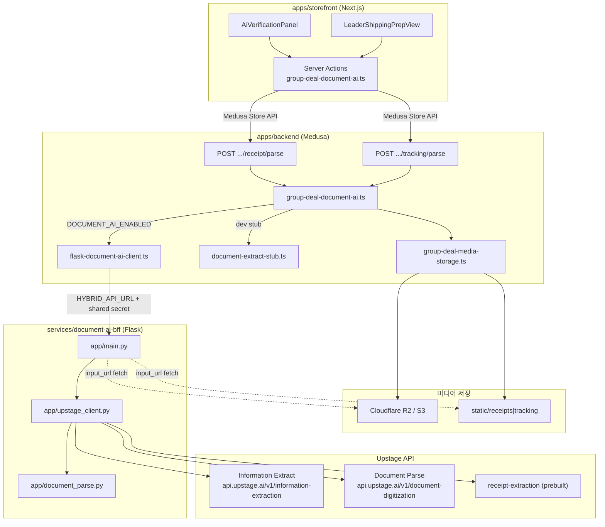
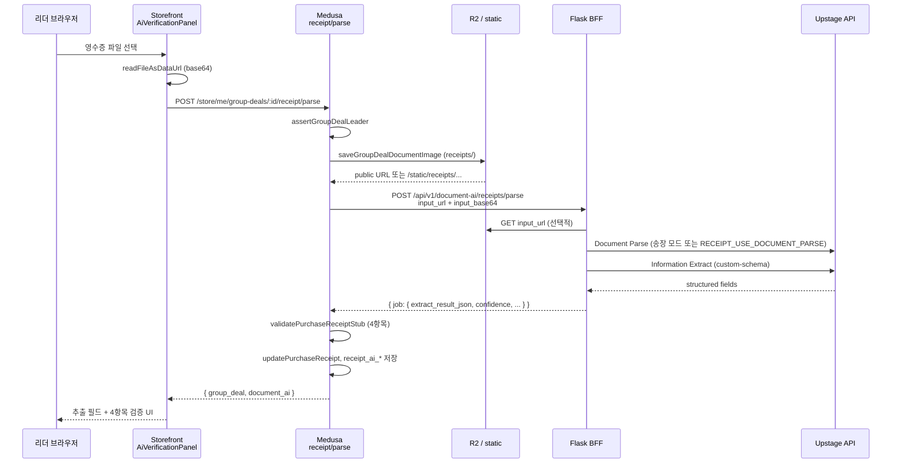

# 모듈 아키텍처 및 Upstage API 연동

## 개요

`group-buying-site` 모노레포에서 **Upstage API를 직접 호출하는 코드는 Flask BFF(`services/document-ai-bff`) 한 곳**뿐입니다. Medusa 백엔드와 Next.js 스토어프론트는 BFF를 HTTP로 호출하며, 개발 환경에서는 Upstage 없이 **스텁 파서**로 대체할 수 있습니다.

공동구매(PURC/SHIP) 흐름에서 Document AI가 담당하는 역할:

| 단계 | 문서 종류 | 목적 |
|------|-----------|------|
| PURC | 구매 영수증(앱 주문 캡처) | 판매처·주문번호·수량·금액 추출 + 4항목 자동 검증 |
| SHIP | 송장/택배 접수 캡처 | 수신자·택배사·송장번호 다건 추출 + 참여자 자동 매칭 |

### 아키텍처 다이어그램



---

## Upstage API 연동 모듈

### 1. Document AI BFF (`services/document-ai-bff`)

**역할:** Medusa와 Upstage 사이의 전용 BFF. Upstage API 키는 **이 서비스에만** 설정합니다.

**주요 파일**

| 파일 | 설명 |
|------|------|
| `app/main.py` | Flask 앱, HTTP 엔드포인트 |
| `app/upstage_client.py` | Upstage Information Extract / Document Parse / prebuilt receipt 호출 |
| `app/document_parse.py` | Upstage Document Parse (`document-parse` 모델) |
| `app/schemas.py` | Information Extract용 JSON Schema (영수증·송장) |
| `app/tracking_mapper.py` | Upstage 결과 → `job` 객체 변환 |
| `app/config.py` | 환경 변수 로딩 |
| `scripts/test_receipt_extract.py` | Medusa 없이 Upstage 단독 테스트 |
| `scripts/test_tracking_extract.py` | 송장 추출 단독 테스트 |

**HTTP 엔드포인트**

| Method | Path | 설명 |
|--------|------|------|
| GET | `/health` | `upstage_configured`, `receipt_mode` 등 상태 |
| POST | `/api/v1/document-ai/receipts/parse` | 영수증 Parse → Extract |
| POST | `/api/v1/document-ai/tracking/parse` | 송장 Parse → Extract (다건 `invoice_rows`) |
| GET | `/api/v1/document-ai/jobs/:id` | Job 조회 (**stub**, 항상 completed 반환) |

**인증:** `X-Hybrid-Shared-Secret` 헤더 (Medusa `HYBRID_API_SHARED_SECRET`과 동일 값)

**Upstage 호출 방식**

1. **Document Parse** (`document_parse.py`)
   - URL: `https://api.upstage.ai/v1/document-digitization`
   - 모델: `document-parse`, `ocr: force`, markdown 출력
   - 송장 파이프라인에서 항상 실행; 영수증은 `RECEIPT_USE_DOCUMENT_PARSE=true`일 때만 선행

2. **Information Extract** (`upstage_client.py`)
   - OpenAI SDK 호환 클라이언트, base URL: `https://api.upstage.ai/v1/information-extraction`
   - 모델: `information-extract`
   - 이미지: base64 data URL을 `image_url`로 전달
   - `schemas.py`의 JSON Schema로 구조화 필드 강제

3. **Prebuilt receipt-extraction** (`UPSTAGE_RECEIPT_MODE=receipt-extraction`)
   - Document Parse 후 `POST .../information-extraction`에 `model=receipt-extraction` (종이 영수증용)

**영수증 모드**

| `UPSTAGE_RECEIPT_MODE` | 동작 |
|------------------------|------|
| `custom-schema` (기본) | IE + 커스텀 JSON schema (앱 주문 캡처 권장) |
| `receipt-extraction` | Upstage prebuilt 종이 영수증 모델 |

**요청 본문 (Medusa → BFF)**

```json
{
  "partner_source": "medusa_group_buying",
  "partner_group_deal_id": "<deal-id>",
  "input_url": "https://.../receipt.png",
  "input_base64": "data:image/png;base64,...",
  "input_file_name": "receipt.png",
  "input_payload_json": {
    "declared_album_quantity": 50,
    "primary_seller": "Weverse Shop"
  }
}
```

입력 소스 우선순위: `input_base64` → `input_url` (BFF가 URL에서 파일 다운로드).

**응답 (`job` 객체 예시 필드)**

- `id`, `job_type`, `status`, `confidence`, `needs_review`
- `extract_result_json.receipt_fields` 또는 `extract_result_json.invoice_rows`
- `parse_result_json.markdown` (Document Parse 결과)

---

### 2. Medusa Document AI 오케스트레이션 (`apps/backend`)

Upstage를 **직접 호출하지 않음**. BFF 클라이언트 또는 개발용 스텁을 선택합니다.

**주요 파일**

| 파일 | 설명 |
|------|------|
| `src/utils/group-deal-document-ai.ts` | 영수증/송장 파싱 오케스트레이션, 참여자 매칭, DB 상태 갱신 |
| `src/utils/flask-document-ai-client.ts` | BFF HTTP 클라이언트 |
| `src/utils/hybrid-api-config.ts` | `DOCUMENT_AI_ENABLED`, `HYBRID_API_URL`, 스텁/프로덕션 분기 |
| `src/utils/document-extract-stub.ts` | 개발용 가짜 OCR 결과 + 4항목 검증 로직 |
| `src/utils/group-deal-media-storage.ts` | 영수증/송장 이미지 저장 (로컬 또는 R2) |
| `src/utils/group-deal-leader-ops.ts` | `saveGroupDealDocumentImage()` 등 리더 전용 헬퍼 |
| `src/utils/group-deal-account.ts` | `receipt_ai_*`, `tracking_ai_*` 직렬화 |

**Store API 라우트 (리더 전용, 인증 필요)**

| Method | Path | 핸들러 |
|--------|------|--------|
| POST | `/store/me/group-deals/:id/receipt/parse` | `processGroupDealReceiptParse` |
| POST | `/store/me/group-deals/:id/tracking/parse` | `processGroupDealTrackingParse` |
| GET | `/store/me/group-deals/:id/document-ai/jobs/:jobId` | `getGroupDealDocumentAiJob` |

파일 위치:

- `src/api/store/me/group-deals/[id]/receipt/parse/route.ts`
- `src/api/store/me/group-deals/[id]/tracking/parse/route.ts`
- `src/api/store/me/group-deals/[id]/document-ai/jobs/[jobId]/route.ts`

**Admin API (Upstage 미사용)**

- `POST /admin/group-deals/:id/receipt` — `document-extract-stub`만 사용 (관리자 수동 업로드)

**영수증 파싱 흐름 (`processGroupDealReceiptParse`)**

1. 리더 권한 확인 (`assertGroupDealLeader`)
2. `receipt_ai_status` → `processing`
3. `saveGroupDealDocumentImage` → R2 또는 `static/receipts/`
4. BFF 또는 스텁 호출
5. `mapFlaskExtractToStructuredReceipt` → 구조화 필드
6. `validatePurchaseReceiptStub` → 4항목 검증 (주문번호, 판매처, 날짜, 수량)
7. 검증 통과 + confidence ≥ threshold → `purchase_receipt_status: verified`
8. `group_deal` + `document_ai` JSON 응답

**송장 파싱 흐름 (`processGroupDealTrackingParse`)**

1. 구매 영수증 verified 선행 (`assertPurchaseReceiptVerified`)
2. 이미지 저장 (`static/tracking/` 또는 R2)
3. BFF/스텁 → `invoice_rows`
4. `matchParticipantsToInvoiceRows` — 이름(80점)+주소 힌트로 참여자 매칭
5. 매칭 성공 시 `bulkUpdateParticipantTracking` + 배송 완료 가능 여부 확인
6. `tracking_ai_result`에 `auto_matched_participant_ids`, `review_conflicts` 저장

**BFF vs 스텁 분기 (`hybrid-api-config.ts`)**

| 조건 | 동작 |
|------|------|
| `DOCUMENT_AI_ENABLED=true` + `HYBRID_API_URL` 설정 | BFF → Upstage |
| `NODE_ENV=development` + AI 미명시 | 스텁 (`document-extract-stub`) |
| `NODE_ENV=production` + BFF 미설정 | `assertDocumentAiBffConfigured()` 에러 |

---

### 3. Storefront Document AI UI (`apps/storefront`)

Upstage/BFF를 **직접 호출하지 않음**. Medusa Store API를 Server Action으로 호출합니다.

**주요 파일**

| 파일 | 설명 |
|------|------|
| `src/lib/data/group-deal-document-ai.ts` | Server Actions: `parseGroupDealReceiptDocument`, `parseGroupDealTrackingDocument`, `retrieveGroupDealDocumentAiJob` |
| `src/modules/group-buying/components/ai-verification-panel/index.tsx` | 파일 업로드 → base64 → parse API → 결과 UI |
| `src/lib/util/group-deal-document-ai-presenter.ts` | 추출 필드·4항목 검증·상태 라벨 변환 |
| `src/types/group-deal-document-ai.ts` | TypeScript 타입 |
| `src/lib/util/medusa-error.ts` | BFF/Upstage 관련 한국어 에러 메시지 |

**UI 진입점**

| 컴포넌트 | 화면 | Document AI 사용 |
|----------|------|------------------|
| `seller-purchase-view` | PURC — 구매 증빙 | `AiVerificationPanel` mode=`purchase` |
| `seller-shipping-view` | SHIP — 발송 (와이어프레임) | `AiVerificationPanel` mode=`shipping` |
| `leader-shipping-prep-view` | 실제 송장 매칭 UI | `parseGroupDealTrackingDocument` 직접 호출 |
| `group-deal-ai-report-panel` | 리포트/계정 화면 | 저장된 AI 결과 표시만 (API 호출 없음) |

**업로드 처리**

1. 클라이언트: `readFileAsDataUrl(file)` → `data:image/...;base64,...`
2. Server Action → Medusa `POST .../receipt|tracking/parse`
3. 응답의 `document_ai.structured_receipt` / `invoice_rows` / `validation`을 UI에 렌더

---

## 연관 모듈 (Upstage 미직접 호출)

Document AI 파이프라인과 연결되지만 Upstage를 호출하지 않는 모듈입니다.

### 미디어 저장 (`group-deal-media-storage.ts`)

- **로컬:** `static/receipts/`, `static/tracking/` (개발)
- **프로덕션:** Cloudflare R2 / S3 (`S3_*` env)
- 업로드 후 공개 URL 생성 → BFF에 `input_url`로 전달 (base64와 병행 전송)
- R2 사용 시 `MEDUSA_BACKEND_URL` 또는 R2 public URL이 BFF에서 접근 가능해야 함

### Group Buying 모듈 (`apps/backend/src/modules/group-buying`)

- `updatePurchaseReceipt()` — 영수증 URL·verified 상태
- `bulkUpdateParticipantTracking()` — AI 매칭 후 송장번호 일괄 저장
- DB 필드: `receipt_ai_status`, `receipt_ai_confidence`, `receipt_ai_job_id`, `receipt_ai_result`, `tracking_ai_*`, `report_stage`

### 리더 구매 증빙 와이어프레임 (`leader-purchase-proof`)

- `leader-purchase-proof-form.tsx` — 로컬 스토리지에 영수증 draft 저장
- **Upstage/API 호출 없음** — 수량 검증 화면으로만 이동
- 실제 AI 파싱은 `seller-purchase-view` + `AiVerificationPanel` 경로

### 송장 매칭 유틸 (`leader-tracking-match.ts`)

- BFF/Medusa가 반환한 `invoice_rows`를 참여자 목록과 클라이언트에서 병합
- 수동 송장 입력·중복 프로필 검사·확정 전 `confirmLeaderShipping` API 호출

### Phase 7 스모크 체크 (`group-buying-phase7-checks.ts`)

- Document AI 직렬화·매핑 함수를 테스트 시나리오에서 검증

### Admin 영수증 (`admin/group-deals/[id]/receipt/route.ts`)

- 관리자 수동 업로드; **스텁 파서만** 사용 (BFF/Upstage 경유 없음)

---

## 환경 변수

### Document AI BFF (`services/document-ai-bff/.env`)

| 변수 | 필수 | 설명 |
|------|------|------|
| `UPSTAGE_API_KEY` | O | Upstage Console Secret Key |
| `HYBRID_SHARED_SECRET` | O (prod) | Medusa와 동일 shared secret |
| `UPSTAGE_RECEIPT_MODE` | | `custom-schema` \| `receipt-extraction` |
| `UPSTAGE_TIMEOUT_SEC` | | Upstage 요청 타임아웃 (기본 90초) |
| `RECEIPT_USE_DOCUMENT_PARSE` | | `true`면 영수증도 Document Parse 선행 |
| `DOCUMENT_AI_AUTO_VERIFY_CONFIDENCE` | | 자동 검증 confidence 임계값 (기본 0.85) |
| `PORT` | | 기본 5000 |

템플릿: `services/document-ai-bff/.env.example`

### Medusa Backend

| 변수 | 설명 |
|------|------|
| `DOCUMENT_AI_ENABLED` | `true` → BFF 사용 (prod 필수) |
| `HYBRID_API_URL` | BFF base URL (예: `https://document-ai-bff.onrender.com`) |
| `HYBRID_API_SHARED_SECRET` | BFF `HYBRID_SHARED_SECRET`과 **동일** |
| `MEDUSA_BACKEND_URL` | BFF가 `input_url`로 이미지 fetch 시 사용 |
| `DOCUMENT_AI_AUTO_VERIFY_CONFIDENCE` | 기본 0.85 |
| `DOCUMENT_AI_REQUEST_TIMEOUT_MS` | BFF HTTP 타임아웃 (기본 prod 120000ms) |
| `AI_ENGINE_URL` / `FLASK_API_URL` | `HYBRID_API_URL` 대체 alias |

템플릿:

- `apps/backend/.env.document-ai.template`
- `apps/backend/.env.production.template` (Document AI + R2 섹션)

**주의:** `UPSTAGE_API_KEY`는 Medusa 백엔드에 넣지 않습니다.

### R2 / Object Storage (Medusa)

| 변수 | 설명 |
|------|------|
| `S3_BUCKET` | R2 버킷명 |
| `S3_REGION` | R2는 `auto` |
| `S3_FILE_URL` | 공개 URL (예: `https://pub-xxx.r2.dev`) |
| `S3_ENDPOINT` | `https://<account>.r2.cloudflarestorage.com` |
| `S3_ACCESS_KEY_ID` / `S3_SECRET_ACCESS_KEY` | R2 API 토큰 |
| `S3_PREFIX` | 기본 `group-buying` |
| `S3_FORCE_PATH_STYLE` | R2에서 `true` 권장 |
| `S3_ACL` | R2는 `false` |

---

## 요청 흐름 예시 (리더 영수증 업로드)

**전제:** `DOCUMENT_AI_ENABLED=true`, BFF 배포 완료, R2 또는 공개 가능한 static URL 설정.



**단계별 상세**

1. **Storefront** — `parseGroupDealReceiptDocument(dealId, { image_base64, filename })`
2. **Medusa** — `processGroupDealReceiptParse`
   - 이미지 저장: `group-deal-media-storage.ts`
   - BFF payload: `partner_group_deal_id`, `input_url` (= `MEDUSA_BACKEND_URL` + path), `input_base64`, `input_payload_json.declared_album_quantity`, `primary_seller`
3. **BFF** — `extract_receipt_with_upstage`
   - `custom-schema`: IE + JSON schema
   - `build_receipt_job` → `needs_review` 판정
4. **Medusa** — Flask job → `StructuredReceiptFields` 매핑 → 검증 → DB 업데이트
5. **Storefront** — `buildReceiptExtractFields`, `buildReceiptVerificationItems`로 UI 표시

**개발(stub) 모드:** 3~4단계에서 BFF/Upstage 대신 `document-extract-stub.ts`가 고정 패턴 데이터 반환.

**송장 업로드**는 동일 패턴이며 엔드포인트만 `tracking/parse`이고, Upstage 파이프라인은 Document Parse + IE로 `invoice_rows`를 추출한 뒤 Medusa에서 참여자 자동 매칭을 수행합니다.

---

## 참고 문서

- `services/document-ai-bff/README.md` — BFF Quick start, Render 배포
- `apps/backend/.env.document-ai.template` — Medusa Document AI env
- `CODE_ANALYSIS.md`, `PROJECT_STATUS.md` — 모노레포 전체 개요
- `docs/upstage-receipt-integration.md` — Upstage 연동 상세 가이드 (별도 문서, README에서 참조)
