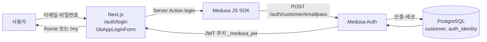
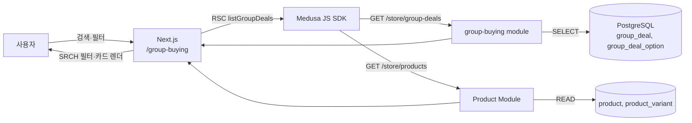
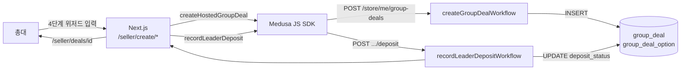
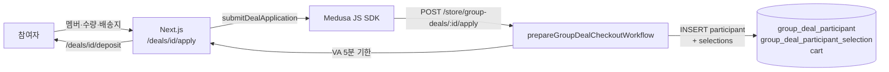
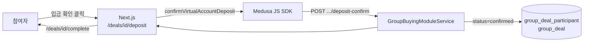

# PokaCatch (포카캐치) — DFD (Data Flow Diagram)

> 발표(PPT)용 자료 · Mermaid flowchart 형식 · 2026-07-23

## 1. 로그인



| 단계 | 역할 |
|------|------|
| **사용자** | 로그인 폼에 이메일·비밀번호 입력 |
| **프론트엔드** | `login()` Server Action → Medusa Auth API 호출, JWT 쿠키 저장 |
| **백엔드** | `emailpass` 프로바이더 인증, 고객 레코드 생성/조회 |
| **데이터베이스** | `customer`, `auth_identity` READ/WRITE |
| **응답** | GB App 홈(`/home`) 또는 마이페이지로 리다이렉트 |

---

## 2. 상품(공구) 조회



| 단계 | 역할 |
|------|------|
| **사용자** | 공구 목록 접속, 검색어·아이돌 그룹·가격 필터 적용 |
| **프론트엔드** | RSC에서 Store API 호출, 클라이언트 SRCH 필터 |
| **백엔드** | `GroupBuyingModuleService.listGroupDeals()` + 상품 enrichment |
| **데이터베이스** | `group_deal`, `group_deal_option`, `product` READ |
| **응답** | 필터링된 공구 카드 목록 렌더링 |

---

## 3. 공동구매 생성 (총대)



| 단계 | 역할 |
|------|------|
| **사용자(총대)** | basic → product → sales → deposit 4단계 위저드 완료 |
| **프론트엔드** | `createHostedGroupDeal()`, `recordLeaderDeposit()` Server Action |
| **백엔드** | deal + options INSERT, 보증금 VA stub 발급, `deposit_status=deposited` |
| **데이터베이스** | `group_deal`, `group_deal_option` WRITE |
| **응답** | 총대 대시보드(`/seller/deals/{id}`)로 이동 |

---

## 4. 공동구매 참여



| 단계 | 역할 |
|------|------|
| **사용자(참여자)** | DETL에서 자리 선택 → APLY에서 배송지 입력 |
| **프론트엔드** | `submitDealApplication()` Server Action |
| **백엔드** | participant + selection INSERT, cart 생성, VA 발급 |
| **데이터베이스** | `group_deal_participant`, `group_deal_participant_selection`, `cart` WRITE |
| **응답** | 입금 안내 화면(`/deposit`)으로 이동 |

---

## 5. 결제

### 5-A. 가상계좌 (v3 기본)



### 5-B. PG 결제 (레거시)

```mermaid
flowchart LR
    U2[참여자] -->|checkout| FE2[/checkout]
    FE2 -->|placeOrder| SDK2[Medusa SDK]
    SDK2 --> BE3[group-deal-billing workflow]
    BE3 --> PG[Toss / Stripe]
    PG --> BE3
    BE3 -->|order 생성| DB2[(order, payment_*)]
```

| 단계 | 역할 |
|------|------|
| **사용자** | VA 입금 후 「입금 확인」 (또는 레거시 PG checkout) |
| **프론트엔드** | `confirmVirtualAccountDeposit()` 또는 checkout 위젯 |
| **백엔드** | participant `status` → confirmed, deal metrics 갱신 |
| **데이터베이스** | `group_deal_participant`, `group_deal` UPDATE |
| **응답** | 참여 확정, `/my` 참여 목록 표시 |

> **참고:** CHKO-02 실제 은행 webhook은 미구현(stub). `deposit-confirm`은 수동 확인 경로입니다.
