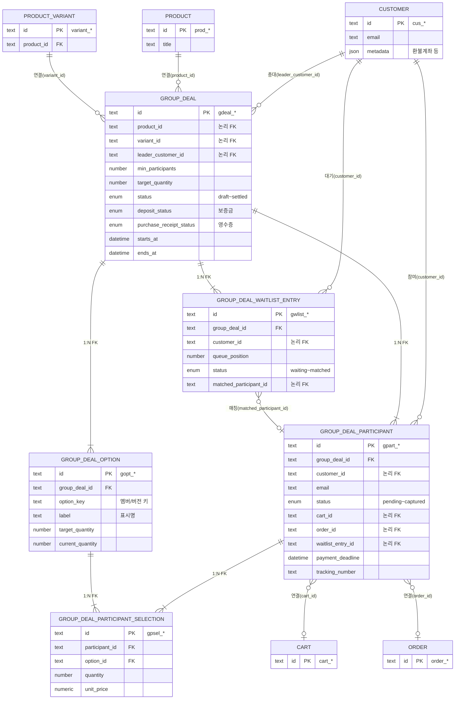

# PokaCatch (포카캐치) — ERD (Entity Relationship Diagram)

> 발표(PPT)용 자료 · Mermaid `erDiagram` 형식 · 2026-07-23

## ERD 다이어그램

## 테이블 설명

| 테이블 | 설명 |
|--------|------|
| **group_deal** | 공동구매 본체. 가격·목표 수량·기간·총대·보증금·영수증/송장 AI 상태·공구 상태 관리 |
| **group_deal_option** | 멤버/버전별 선택 옵션. 옵션별 목표·현재 수량·단가 관리 |
| **group_deal_participant** | 참여자. 결제 상태·가상계좌 기한·송장·1차/2차 결제 금액 |
| **group_deal_participant_selection** | **N:M 중간 테이블** — 참여자 ↔ 옵션 간 수량 선택 |
| **group_deal_waitlist_entry** | 공석 발생 시 자동 매칭용 대기자 큐 |

## 관계 설명

| 관계 | 카디널리티 | FK 유형 | 설명 |
|------|:---------:|---------|------|
| group_deal → option / participant / waitlist | **1:N** | DB FK | `ON DELETE CASCADE` |
| participant ↔ option (via selection) | **N:M** | DB FK | selection 테이블로 연결 |
| group_deal → product / customer(총대) | **N:1** | 논리 ID | Medusa 코어 참조 (DB FK 없음) |
| participant → cart / order | **N:1** | 논리 ID | 결제 경로별 (VA / PG) |

## DB FK 제약 (마이그레이션 기준)

| 자식 테이블 | FK 컬럼 | 부모 |
|-------------|---------|------|
| group_deal_option | group_deal_id | group_deal |
| group_deal_participant | group_deal_id | group_deal |
| group_deal_participant_selection | participant_id | group_deal_participant |
| group_deal_participant_selection | option_id | group_deal_option |
| group_deal_waitlist_entry | group_deal_id | group_deal |
